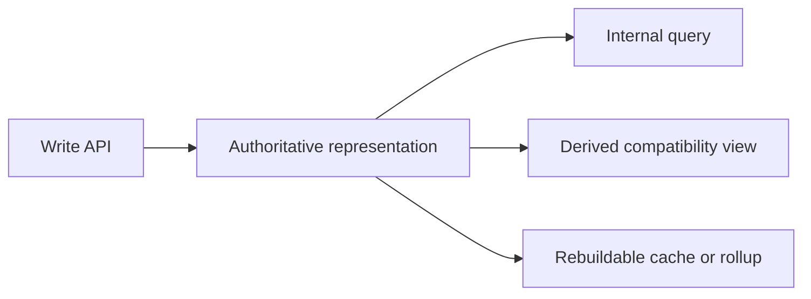

# Authoritative data representation

> [!definition]
> An authoritative data representation is the stored form whose value determines correctness when multiple forms expose the same logical fact. Other forms are derived views, caches, compatibility projections, or migration intermediates and must not independently compete as sources of truth.

## Mental model

When one logical value exists in several places, every read and write path needs a deterministic ownership rule:

Authority answers three separate questions:

- Where does a supported write go?
- Which value wins when stored forms disagree?
- Which forms can be deleted and reconstructed without information loss?

During a migration, authority can change by phase. Old storage may remain authoritative while a new column is backfilled. After validation and cutover, the new column becomes authoritative and the old API shape is synthesized from it.

## Concrete example

RFC 0006 moves `session_id` from a reserved trace metadata row onto `trace_info.session_id`:

1. historical metadata is copied into the column;
2. session readers and writers switch to the column;
3. API responses synthesize `TRACE_SESSION` metadata from the column;
4. duplicate metadata rows are deleted;
5. downgrade recreates the metadata row from the column before dropping it.

After step 2, a writer that recreates only the old metadata row is incorrect even if legacy API output still includes that shape.

## Boundaries and pitfalls

- “Source of truth” is meaningless unless reads, writes, conflict handling, cleanup, and reconstruction all follow it.
- Dual writes do not create two authorities; they create one authority plus a consistency obligation.
- A derived representation may be the fastest read path without owning the fact. A [Database rollup table](Database%20rollup%20table.md) is authoritative only for its declared covered partition and aggregate semantics.
- Deleting the old representation before [Data migration validation](Data%20migration%20validation.md) can make disagreement impossible to diagnose or repair.
- Compatibility synthesis must preserve observable semantics, including deletion, null, and empty-value distinctions.

## In the work

[2026-07-31 - Implement RFC 0006 PostgreSQL trace analytics optimization](../Tasks/2026-07-31%20-%20Implement%20RFC%200006%20PostgreSQL%20trace%20analytics%20optimization.md) changes authority for trace name, session, reserved tokens, trace costs, span costs, and model/provider dimensions. PR #24760 implements the read/write retargeting and compatibility synthesis that turns new columns from backfilled copies into the owning representation.

## Related concepts

- [Database denormalization](Database%20denormalization.md)
- [Backward compatibility](Backward%20compatibility.md)
- [Online schema migration](Online%20schema%20migration.md)
- [Data migration validation](Data%20migration%20validation.md)
- [Database rollup table](Database%20rollup%20table.md)

## Further reading

- [MLflow RFC 0006: authoritative trace analytics fields](https://github.com/mlflow/rfcs/blob/main/rfcs/0006-postgres-optimizations/0006-traces-optimizations.md)

