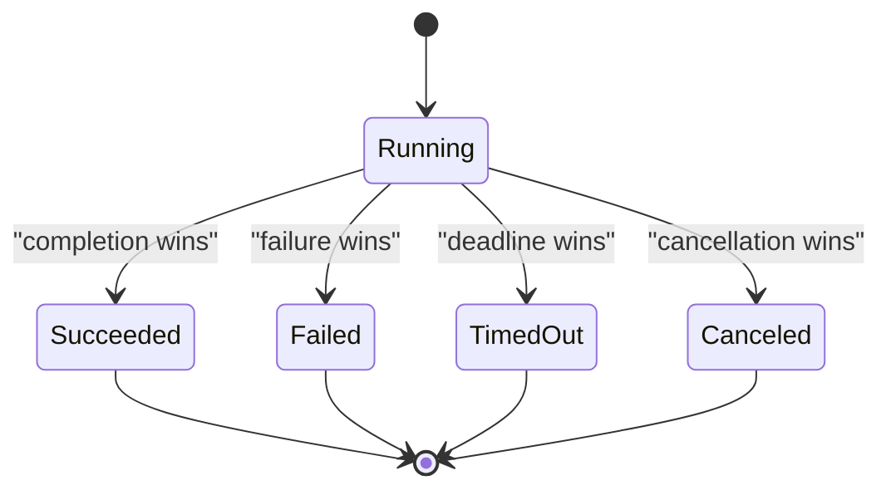

# Cancellation races

> [!definition]
> A cancellation race occurs when a request to cancel work overlaps with that work completing, failing, or timing out. More than one actor competes to choose the terminal state.

This is a specialized [Race condition](Race%20condition.md). It cannot be solved merely by “checking first,” because the state may change immediately after the check.

## Competing histories



A correct state machine makes terminal states final. Exactly one transition out of `Running` wins.

## Linearization

The operation needs a [Linearization point](Linearization%20point.md): one conceptual instant at which the system commits to a terminal outcome.

```python
with record.lock:
    if record.result is not None:
        return record.result

    if terminate_process_group(record.process):
        record.result = canceled_result()
        return record.result

# The process may have completed before termination was delivered.
return collect_authoritative_result(record)
```

The important idea is not this exact pseudocode. It is that a failed cancellation attempt must not overwrite a result that already became authoritative.

## API semantics

“Cancel requested” and “job canceled” are different facts:

- **Accepted cancellation:** termination won; terminal state is `CANCELED`.
- **Lost cancellation race:** work finished first; return `SUCCEEDED` or `FAILED`.
- **Already terminal:** cancellation is a no-op or returns the existing result.
- **Timeout:** the executor's deadline won; report `TIMED_OUT`, not user cancellation.

Good APIs document whether `cancel()` means “request cancellation” or guarantees a canceled terminal state.

## Process interaction

Cancellation involves two layers:

1. Logical state protected by [Mutual exclusion](Mutual%20exclusion.md).
2. Physical termination using [signals](Unix%20signal.md), often against [POSIX process groups](POSIX%20process%20groups.md).

The physical signal can itself lose to process completion or encounter [PID reuse](PID%20reuse.md). The logical state machine must remain correct in every case.

## In the MLflow work

In [2026-07-28 - Implement LocalJobExecutor](../Tasks/2026-07-28%20-%20Implement%20LocalJobExecutor.md), cancellation rolls back its tentative canceled state when process termination was not delivered, then returns the actual completed result. Timeout messages remain separate and include the job identity and configured duration.

## Related concepts

- [Race condition](Race%20condition.md)
- [Linearization point](Linearization%20point.md)
- [Mutual exclusion](Mutual%20exclusion.md)
- [PID reuse](PID%20reuse.md)
- [POSIX process groups](POSIX%20process%20groups.md)
- [Idempotency](Idempotency.md)

