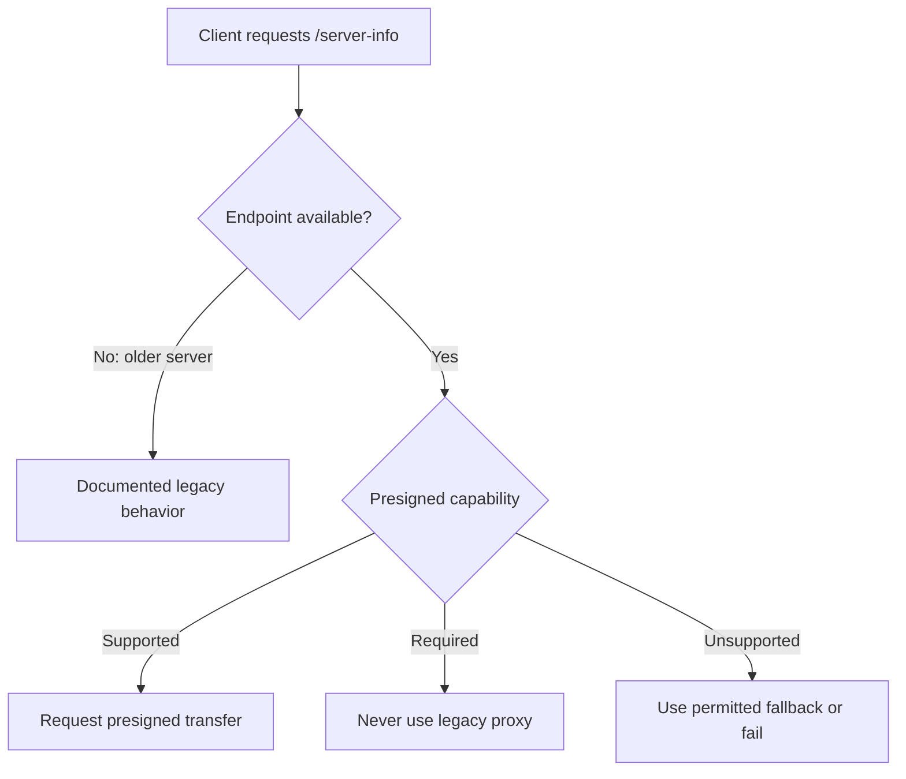

# Capability negotiation

> [!definition]
> Capability negotiation is a protocol in which participants discover supported behavior and choose a mutually compatible path.

A [Capability](Capability.md) describes what a component can do. Negotiation turns that description into a runtime decision, which is especially useful during rolling upgrades and mixed client/server versions.

## The three-state problem

For compatibility, a client often needs more than a Boolean:

| Discovery result | Meaning | Possible client behavior |
|---|---|---|
| Property is `true` | Server explicitly supports or requires feature | Use the new path |
| Property is `false` | Server explicitly does not support feature | Use allowed old path or fail |
| Endpoint/property absent | Older server; capability is unknown | Apply documented legacy behavior |

Conflating “absent” with “false” can break [Backward compatibility](Backward%20compatibility.md). Conflating “false” with a transient discovery error can produce unsafe [Fallback behavior](Fallback%20behavior.md).

## MLflow example

The response belongs to the server-client protocol. A client should not infer the server's state from a local [Environment variable](Environment%20variable.md); that would violate [Configuration ownership](Configuration%20ownership.md).

## Caching

Capability responses are attractive to cache because they change rarely, but cache scope matters:

- key by complete server identity, including base URL or workspace prefix;
- share successful results where useful;
- avoid permanently caching transient 500 or network failures;
- bound memory use;
- deduplicate identical requests already in flight;
- define behavior when the server changes during the cache lifetime.

This connects the UI work to the centralized `/server-info` work in PR #24678.

## Design questions

- Is the property descriptive (“supports X”) or prescriptive (“requires X”)?
- Does a missing endpoint identify an old server or a broken deployment?
- Which errors allow fallback?
- Is the capability stable enough for process-wide caching?
- Does every code path—including small uploads—consult the same decision?

## In the MLflow work

[2026-07-26 - Add presigned artifact UI support](../Tasks/2026-07-26%20-%20Add%20presigned%20artifact%20UI%20support.md) requires capability discovery for all artifact sizes. A server that requires presigned transfer cannot allow the client to skip discovery and use a legacy route for small files.

## Related concepts

- [Capability](Capability.md)
- [Backward compatibility](Backward%20compatibility.md)
- [Fallback behavior](Fallback%20behavior.md)
- [Client-server model](Client-server%20model.md)
- [Configuration ownership](Configuration%20ownership.md)
- [Fail-fast validation](Fail-fast%20validation.md)

