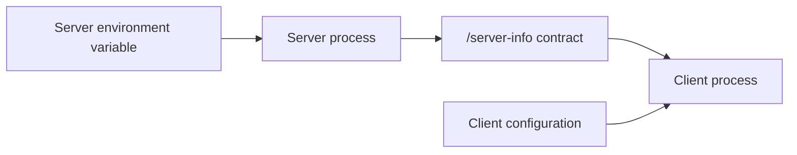

# Configuration ownership

> [!definition]
> Configuration ownership identifies which component interprets a setting, which behavior it controls, and how other components learn the resulting state.

Shared code does not imply shared configuration. In a [[Client-server model]], client and server may import the same Python package while running in different processes, containers, machines, or organizations.

## The boundary



A server-only [[Environment variable]] should configure the server process. If the client needs to adapt, the server communicates a [[Capability]] through the API.

## The accidental-coupling bug

```python
# Problematic in shared client/server code:
if MLFLOW_ARTIFACTS_ONLY_PRESIGNED.get():
    client_disable_legacy_uploads()
```

This appears to work when server and client run in one development shell. It becomes incorrect when:

- the client is remote and cannot see the server environment;
- a client happens to define the same variable for another reason;
- a test mutates process environment and changes unrelated client behavior;
- server policy changes while a long-running client remains alive.

## Better division

```python
# Server startup
presigned_only = parse_server_configuration()
validate_backend(presigned_only)

# Client runtime
server_info = get_server_info(tracking_uri)
transfer_policy = choose_policy(server_info)
```

This separates:

- **server intent**, owned by startup configuration;
- **advertised behavior**, owned by the API contract;
- **client choice**, owned by compatibility logic.

## Questions for any setting

1. Who sets it?
2. Which process reads it?
3. Is it policy, preference, or observed capability?
4. Must it cross a network boundary?
5. What is the default when it is absent?
6. Can it change during the process lifetime?

## In the MLflow work

[[2026-07-26 - Add presigned artifact UI support]] removed a server-scoped environment variable from Python client decision-making. Clients now rely on `/server-info` [[Capability negotiation]].

## Related concepts

- [[Environment variable]]
- [[Client-server model]]
- [[Capability]]
- [[Capability negotiation]]
- [[Backward compatibility]]

