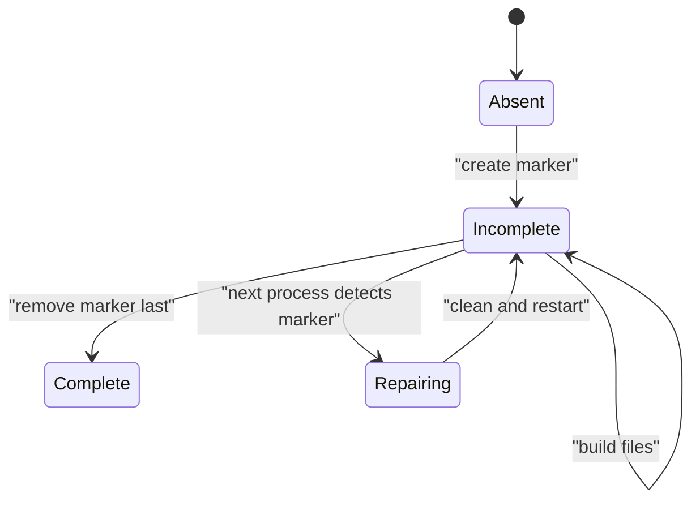

# Crash consistency

> [!definition]
> Crash consistency means that after interruption at any point, persisted state is either valid or recognizably incomplete and recoverable.

The interruption might be a power loss, kernel failure, `SIGKILL`, container termination, or process crash. Cleanup code is helpful but cannot be the only guarantee because abrupt termination may prevent it from running.

## Start with an invariant

For an environment directory:

> If the environment is used, it must be known complete. If completeness is uncertain, rebuild it.

One protocol uses a durable incomplete marker:



The ordering matters. Create the marker **before** modifying the resource and remove it **after** successful setup.

## Example protocol

```python
with environment_lock:
    if incomplete_marker.exists():
        remove_partial_environment()

    if environment_is_complete():
        return

    incomplete_marker.touch()
    try:
        build_environment_at_final_path()
    except BaseException:
        remove_partial_environment()
        raise
    else:
        incomplete_marker.unlink()
```

The exception cleanup improves normal failure handling. The marker protects recovery when the process dies before the `except` block runs.

## Durability caveat

“Written” is not always the same as [durable](Durable%20state.md). Operating systems and storage devices buffer writes. Strong crash guarantees may require flushing file data and directory metadata. The right strength depends on the cost of false completeness and the storage system.

## Alternative patterns

- Build a complete replacement and publish it with an [atomic rename](Atomic%20filesystem%20operation.md).
- Use a database transaction or journal.
- Record a version/checksum manifest and validate it on startup.

For Python virtual environments, building elsewhere and renaming can be unsafe because generated files may contain absolute paths. [2026-07-28 - Implement LocalJobExecutor](../Tasks/2026-07-28%20-%20Implement%20LocalJobExecutor.md) therefore builds at the final path and uses [File locking](File%20locking.md) plus an incomplete marker.

## Relationship to idempotency

- Crash consistency makes interrupted state detectable.
- [Idempotent setup](Idempotent%20setup.md) makes retry or repair safe.
- [File locking](File%20locking.md) prevents multiple repairers from acting simultaneously.

The three properties complement rather than replace each other.

## Related concepts

- [Durable state](Durable%20state.md)
- [Atomic filesystem operation](Atomic%20filesystem%20operation.md)
- [File locking](File%20locking.md)
- [Idempotency](Idempotency.md)
- [Idempotent setup](Idempotent%20setup.md)

