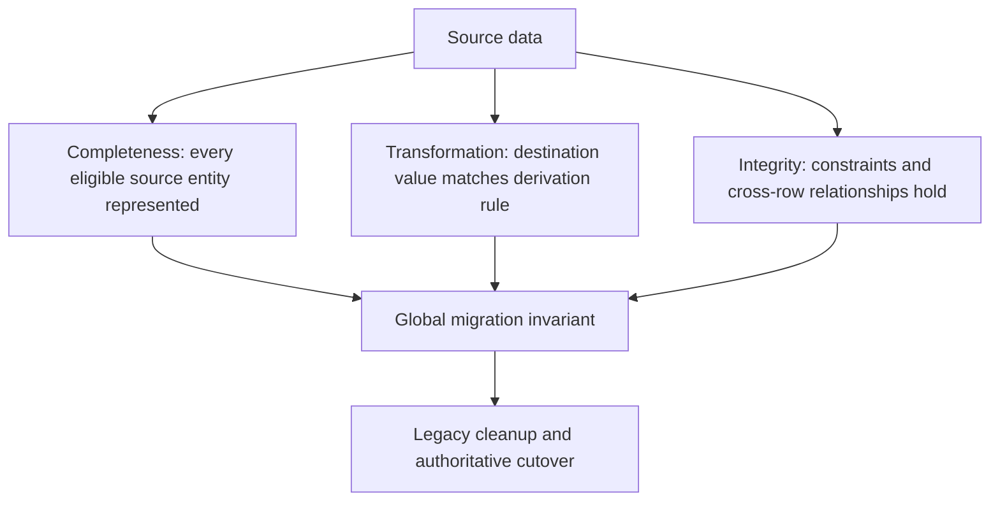

# Data migration validation

> [!definition]
> Data migration validation establishes that a destination representation satisfies explicit completeness, transformation, and integrity invariants relative to its authoritative input. It verifies data meaning, not merely migration process success, scanned row counts, or the absence of exceptions.

## Mental model: validation layers



- **Completeness** detects missing destination values or entities.
- **Transformation correctness** compares destination values with the deterministic conversion rule.
- **Integrity** checks nullability, uniqueness, domain constraints, and ownership relationships.
- **Operational validation** records enough diagnostics to identify the entity, rule, and corrective action when an invariant fails.

Cleanup should occur only after the relevant source-to-destination invariant passes. Once legacy data is deleted, validation may no longer have enough information to distinguish a correct conversion from irreversible loss.

## Why row counts are insufficient

Two tables can have identical counts while every mapped value is wrong. Counts also fail when the relationship is not one-to-one, when null values are valid, or when cleanup intentionally changes row cardinality.

```text
Source:      trace 42 → session "abc"
Destination: trace 42 → session "xyz"

Counts:      1 = 1      ✓
Invariant:   "abc" = "xyz"  ✗
```

Validation must encode the semantic mapping. For assessment values in RFC 0006, the rule includes type-sensitive coercion: finite JSON numbers, booleans, and trimmed case-insensitive yes/no values populate `aggregate_value`, while numeric strings do not. A generic “destination is non-null” check would reject valid nulls and accept incorrectly coerced values.

## Batch and global validation

Per-batch checks localize failure and prevent a known-bad batch from committing. They do not prove global completeness when writes continue concurrently.

```mermaid
sequenceDiagram
    participant U as Prepopulation utility
    participant A as Live application
    participant M as Final migration

    U->>U: update and validate batch 1
    U->>U: update and validate batch 2
    A->>A: insert or modify row behind utility cursor
    U->>U: finish traversal
    Note over U: Batch checks passed; global invariant not yet established
    M->>M: stop old writers, catch residual rows
    M->>M: validate global invariants
    M->>M: delete legacy duplicates and cut over
```

The migration is the final authority because it runs in the controlled transition window and can search for all residual violations rather than trusting a utility cursor or completion timestamp.

## Concrete example: RFC 0006 invariant families

| Entity | Example validation obligation |
| --- | --- |
| Trace name | Column matches reserved tag semantics, including deletion/null behavior |
| Session | Column matches `TRACE_SESSION`; API synthesis can reconstruct the legacy shape |
| Reserved tokens | Five columns match reserved metrics; custom metrics remain untouched |
| Trace cost | Trace totals match trace-level cost metadata and are not substituted with span breakdowns |
| Span cost | Cost columns match reserved span metrics |
| Model/provider | Columns preserve values and null-versus-empty JSON behavior before `dimension_attributes` is dropped |
| Assessment ownership | `experiment_id` and `trace_timestamp_ms` match the owning trace |
| Assessment aggregate | `aggregate_value` and `is_numeric_value` match the exact coercion matrix |
| Rollup partition | Stored aggregates match source rows for the declared grain and no invalidation marker exists |

## Validation query design

Useful patterns include:

- anti-joins or `NOT EXISTS` searches for missing destinations;
- null-safe comparisons between source derivation and destination;
- grouped duplicate checks for keys expected to be unique;
- domain checks for finite values and allowed enums;
- sampled diagnostic output after an exact global violation count identifies failure;
- checksums only when serialization and ordering are canonical and collision risk is acceptable.

Validation queries can themselves be expensive. They should use the same bounded key ranges or indexed predicates as the migration where possible, while the final result still covers the entire required domain.

## Boundaries and pitfalls

- Process exit status proves control-flow completion, not data correctness.
- A scanned-row counter does not account for concurrent inserts behind the cursor.
- Sampling is useful for diagnostics or confidence but cannot prove a universal invariant.
- Comparing two implementations of the same flawed conversion can produce false agreement; derive expected behavior from one explicit semantic specification.
- Validation performed after dropping the source representation cannot prove reconstructability.
- Logs must identify failures without exposing sensitive trace content.
- A downgrade needs its own validation because it reconstructs a different representation.

## In the work

[[2026-07-31 - Implement RFC 0006 PostgreSQL trace analytics optimization]] requires revision `75868b020152` to validate before deleting duplicate tags, metadata, metrics, or `dimension_attributes`. [[2026-07-31 - Prepopulate denormalized trace analytics]] may reduce the migration's rewrite volume, but its successful completion is not the global validation event.

## Related concepts

- [[Database backfill]]
- [[Online schema migration]]
- [[Database denormalization]]
- [[Authoritative data representation]]
- [[Transaction boundary]]

## Further reading

- [MLflow PR #24588: SQL trace analytics schema and backfill](https://github.com/mlflow/mlflow/pull/24588)
- [MLflow RFC 0006: adoption strategy](https://github.com/mlflow/rfcs/blob/main/rfcs/0006-postgres-optimizations/0006-traces-optimizations.md#adoption-strategy)
