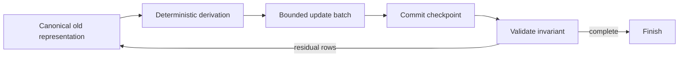

# Database backfill

> [!definition]
> A database backfill derives and writes newly required state for records that existed before the current schema or invariant. A production-safe backfill is restartable, bounded, observable, and paired with a strategy for writes that occur while it runs.

## Mental model

A backfill is a reconciliation loop rather than a one-time script:

The cursor records traversal progress, but the invariant determines completion. This distinction matters on a live table: rows can be inserted or modified while the cursor moves.

## Concrete example

Assume historical trace rows have no `user_id`, while the canonical value is in metadata. A batch can select the next 250 trace IDs after the previous cursor, derive each `user_id`, conditionally update it, validate the batch, and commit. If the process stops after ID 10,000, the committed batches remain valid and a rerun can revisit or continue them.

The final pass must still search for unresolved rows. A new trace inserted with a key outside an earlier scan, or a trace updated after its batch, cannot be declared correct solely because the cursor reached the former end.

## Boundaries and pitfalls

- Large batches increase throughput but also lock time, transaction logs, rollback cost, replication lag, and contention.
- Very small batches add round trips and commit overhead. Batch size is an operational control, not a universal constant.
- Row counts can agree while values are semantically wrong; validation should compare derived content or explicit invariants.
- A read-then-write implementation can overwrite concurrent changes unless updates are conditional and the source-of-truth rule is clear.
- Retrying is safe only if the operation has [[Idempotency]] and does not compound side effects.
- Backfill code is production code: it needs tests, progress reporting, failure diagnostics, and a supported invocation path.

## In the work

The utility in [[2026-07-31 - Prepopulate denormalized trace analytics]] is a live backfill separated from the final migration. The ticket exists because rewriting large trace histories synchronously during upgrade can make the maintenance window unacceptable.

## Related concepts

- [[Online schema migration]]
- [[Keyset pagination]]
- [[Transaction boundary]]
- [[Idempotency]]
- [[Data migration validation]]

## Further reading

- [MLflow PR #24588: batched trace analytics migration](https://github.com/mlflow/mlflow/pull/24588)
