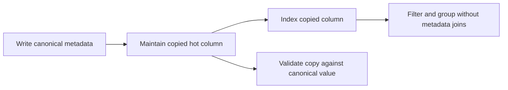

# Database denormalization

> [!definition]
> Database denormalization deliberately stores a fact in an additional, query-friendly location so important reads require fewer joins, lookups, or runtime transformations. It trades cheaper reads for duplicated state that every write and migration must keep consistent.

## Mental model

Normalization asks, “Where is the single canonical fact?” Denormalization asks, “Which derived copy makes the dominant read path cheap enough?” The original fact can remain authoritative while a copied column becomes the optimized read representation.



The central obligation is not merely adding a column. Every creation, update, import, restoration, and historical [[Database backfill|backfill]] must preserve the relationship between the source value and its copy.

## Concrete example

Suppose a trace's user is stored generically as a metadata pair:

```text
trace_metadata(trace_id=42, key="mlflow.user", value="ana")
```

An analytics query grouping traces by user must join and filter the metadata table. A denormalized design also stores:

```text
traces(id=42, user_id="ana")
```

Now `user_id` can have a targeted [[Database index]], and the common query reads the trace table directly. The metadata record may remain the compatibility source during rollout.

## Boundaries and pitfalls

- Denormalization is selective. Copying every flexible attribute into fixed columns creates a wide, rigid schema without proving that reads benefit.
- A copied value can become stale if one write path forgets to maintain it.
- Faster reads usually mean additional write work, index maintenance, storage, and replication traffic.
- A column alone does not guarantee a better plan; selectivity, indexes, statistics, and query shape still matter.
- Denormalization is different from a [[Database rollup table]]: a copied row-level fact preserves granularity, while a rollup stores an aggregate such as a daily count.

## In the work

RFC 0006 uses denormalization to move frequently queried trace, span, and assessment attributes out of generic metadata/tag joins and onto their owning rows. In [[2026-07-31 - Prepopulate denormalized trace analytics]], the utility's job is to create those copies for historical data before the final schema upgrade.

## Related concepts

- [[Entity-attribute-value model]]
- [[Database index]]
- [[Database backfill]]
- [[Data migration validation]]
- [[Database rollup table]]

## Further reading

- [MLflow RFC 0006: PostgreSQL trace optimizations](https://github.com/mlflow/rfcs/blob/main/rfcs/0006-postgres-optimizations/0006-traces-optimizations.md)

