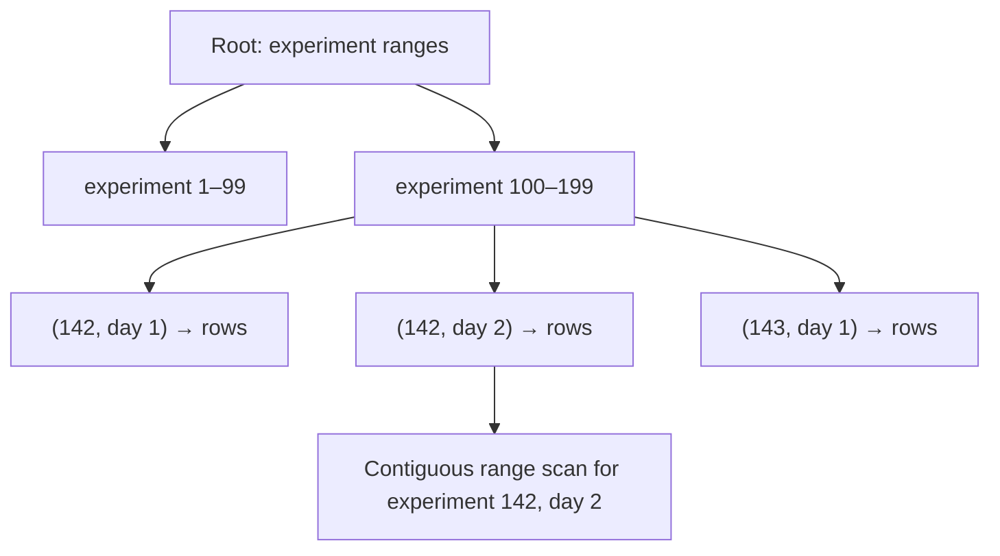
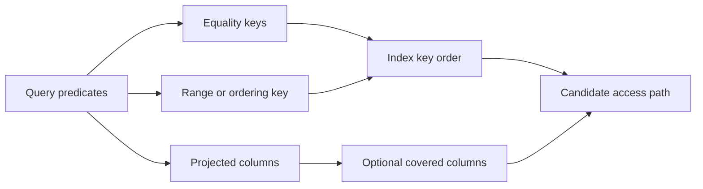

# Database index

> [!definition]
> A database index is an auxiliary structure that maps indexed keys to table rows, allowing the optimizer to avoid or reduce a full scan for matching predicates, ordering, joins, and some aggregates. An index is useful only when its key order, predicate, coverage, and selectivity match a real query shape closely enough to offset storage and write-maintenance costs.

## Mental model: B-tree and composite order

Most relational indexes used by RFC 0006 are B-tree indexes. Internal pages route comparisons toward leaf pages; leaf entries are ordered by the indexed key and identify table rows.



For a composite index `(experiment_id, trace_timestamp_ms, name)`, key order is lexicographic. Equality on `experiment_id` followed by a timestamp range produces a contiguous scan. Once a range is used, later columns often help filtering or coverage but usually cannot further narrow the B-tree seek in the same way.

## Composite-key design

Given:

```sql
WHERE experiment_id = :experiment
  AND trace_timestamp_ms >= :start
  AND trace_timestamp_ms < :end
  AND name = :assessment_name
```

`(experiment_id, trace_timestamp_ms, name)` supports the experiment/time-series path. `(experiment_id, name, valid)` supports a different path centered on experiment, assessment name, and validity. There is no universally optimal column order; it follows predicate shape, selectivity, ordering requirements, and the joins that the plan should avoid.



## Partial and covering indexes

A partial index stores only rows satisfying a fixed predicate:

```sql
CREATE INDEX ... ON spans (trace_id, start_time_unix_nano)
WHERE input_cost IS NOT NULL
   OR output_cost IS NOT NULL
   OR total_cost IS NOT NULL;
```

This excludes spans irrelevant to cost analytics, reducing index size and maintenance. The query predicate must logically imply the index predicate for the optimizer to use it safely.

A covering index includes columns needed by a query so the engine may avoid fetching the base table. PostgreSQL's `INCLUDE` columns are stored at leaf entries but do not participate in ordering. Index-only scans still depend on visibility information and workload conditions; `INCLUDE` is not a guarantee that heap access disappears.

## Concrete example: RFC 0006 index families

| Family | Leading access path | Reason for separation |
| --- | --- | --- |
| Assessment time series | experiment → trace timestamp | Direct time-range aggregation |
| Assessment name analytics | experiment → timestamp/name or name/valid | Different predicate order and grouping |
| Raw span cost | trace → span start time | Joins from prefiltered trace IDs |
| Rollup build | experiment → span start time | Scans a complete experiment/day partition |
| Rollup lookup | workspace → experiment → day → metric → grouping set | Exact partition and aggregate lookup |

The two span indexes are not redundant: trace-first raw queries and experiment/day rollup builds begin from different keys.

## Cost model and verification

Indexes impose:

- storage for pages and included values;
- extra writes and WAL/redo for inserts, deletes, and indexed-column updates;
- page splits and vacuum/maintenance work;
- planner complexity and potentially incorrect choices under stale statistics.

Verification requires a representative [[Query execution plan]], not just index existence. For PostgreSQL, `EXPLAIN (ANALYZE, BUFFERS)` establishes whether the index is selected, how many rows are visited, whether base-table fetches occur, and whether estimates match actual cardinality.

## Boundaries and pitfalls

- Low-selectivity predicates may be faster as sequential scans.
- Redundant overlapping indexes multiply write cost without adding a distinct access path.
- A large covering index can approach a second copy of the table.
- Functions or casts on an indexed column may require an expression index or prevent direct use.
- Cross-backend syntax differs: RFC 0006 preserves leading-key order on MySQL, MSSQL, and SQLite but removes unsupported PostgreSQL `INCLUDE` or partial predicates.
- Index creation itself can lock or load a production database; migration behavior must be evaluated per engine.

## In the work

[[2026-07-31 - Implement RFC 0006 PostgreSQL trace analytics optimization]] adds targeted indexes only for assessment, span-cost, and rollup access paths. It explicitly rejects a broad `trace_info` covering index because the existing experiment/time path remains the initial trace restriction and no broader index was justified by the benchmark.

## Related concepts

- [[Query execution plan]]
- [[Database denormalization]]
- [[Entity-attribute-value model]]
- [[Keyset pagination]]
- [[Database rollup table]]

## Further reading

- [PostgreSQL documentation: Indexes](https://www.postgresql.org/docs/current/indexes.html)
- [PostgreSQL documentation: Index-only scans and covering indexes](https://www.postgresql.org/docs/current/indexes-index-only-scans.html)
- [PostgreSQL documentation: Partial indexes](https://www.postgresql.org/docs/current/indexes-partial.html)
