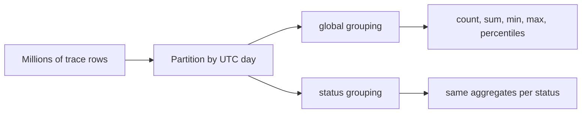
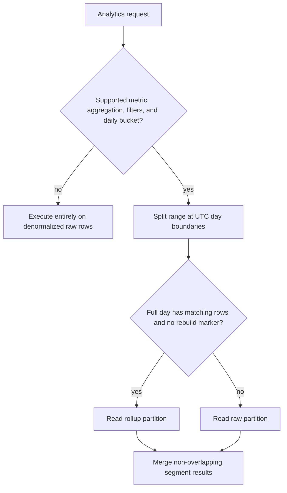

# Database rollup table

> [!definition]
> A database rollup table stores aggregates computed from detailed rows at a declared grain, such as one day, experiment, metric, and grouping set. It trades freshness, storage, and maintenance logic for predictable reads over far fewer rows while retaining the detailed table as the fallback for unsupported or invalid partitions.

## Mental model: grain and dimensionality

The grain defines what one rollup row means. A trace rollup key such as:

```text
(workspace, experiment_id, rollup_day, metric_name, grouping_set, trace_status)
```

states that every aggregate value belongs to exactly one workspace, experiment, UTC day, metric, and grouping interpretation. `grouping_set='global'` is semantically different from a grouped dimension whose value happens to be null.



Every added grouping dimension multiplies possible rows. A bounded status vocabulary is suitable. User-controlled trace names or assessment values can approach one distinct value per source row, causing the rollup to lose its compression advantage.

## Aggregate composability

Rollups can combine partitions only when sufficient intermediate state is stored:

| Aggregate | Stored state | Cross-partition merge |
| --- | --- | --- |
| `COUNT` | count | Sum counts |
| `SUM` | sum | Sum sums |
| `AVG` | sum and count | `Σsum / Σcount` |
| `MIN` | minimum | Minimum of minima |
| `MAX` | maximum | Maximum of maxima |
| Exact percentile | raw distribution or equivalent exact state | Not derivable from daily percentile scalars |
| Distinct count | exact set or mergeable sketch | Not derivable from daily counts |

This is why RFC 0006 keeps distinct session counts raw and limits stored exact p50/p90/p99 values to matching complete-day requests; see [[Percentile aggregation]].

## Hybrid query routing

A correct rollup system is a planner over time segments rather than an all-or-nothing cache:



The first and last partial days stay raw. Complete middle days may use rollups independently. Missing rows or [[Rollup invalidation|invalid partitions]] also fall back to raw data. The ranges must not overlap, or the final aggregate double-counts source rows.

## Publication and freshness

Rollup correctness has two layers:

1. **Content correctness:** the aggregate matches its source partition at publication time.
2. **Validity correctness:** the reader can determine whether a later source mutation has made it stale.

Atomic replacement prevents readers from observing half a partition. Durable invalidation prevents a fully published but stale partition from being used. The source tables remain the repair source even after rollups exist.

## Concrete example: RFC 0006 layout

RFC 0006 defines three data tables and one rebuild queue:

- trace metric daily rollups with global/status grouping and PostgreSQL daily percentiles;
- span-cost daily rollups with global/model/provider/model-provider grouping;
- assessment daily rollups with global grouping only;
- a queue keyed by workspace, experiment, UTC day, and rollup family.

Rollups are disabled by default. `MLFLOW_SQL_TRACE_ROLLUPS_ENABLED` opts into query use and maintenance. `MLFLOW_TRACE_ROLLUPS_SCHEDULE` controls a single scheduled builder, initially one worker until multi-replica coordination exists.

## Boundaries and pitfalls

- A rollup is not the [[Authoritative data representation]] for arbitrary queries; its authority is limited to declared grain, dimensions, aggregate semantics, and valid partitions.
- High-cardinality grouping can make the summary nearly as large as the detail table.
- Late data, deletes, moves, and corrections require old and new partition invalidation.
- Rebuilding too eagerly increases write and compute cost; rebuilding too slowly shifts more reads to the raw path.
- A daily grain cannot serve arbitrary bucket widths without semantic changes.
- Time zone rules must be explicit. RFC 0006 uses UTC-aligned days because the API currently uses UTC-aligned buckets.
- Approximate sketches require an explicit API accuracy contract; they cannot silently replace exact raw behavior.

## In the work

In [[2026-07-31 - Implement RFC 0006 PostgreSQL trace analytics optimization]], denormalized columns first reduce join cost. Rollups are the second layer for repeated aggregation over millions of already-denormalized rows. RHOAIENG-78201 owns construction and routing; RHOAIENG-78203 owns external scheduling.

## Related concepts

- [[Database denormalization]]
- [[Rollup invalidation]]
- [[Percentile aggregation]]
- [[Query execution plan]]
- [[Data migration validation]]

## Further reading

- [MLflow RFC 0006: opt-in SQL daily rollups](https://github.com/mlflow/rfcs/blob/main/rfcs/0006-postgres-optimizations/0006-traces-optimizations.md#5-opt-in-sql-daily-rollups)
