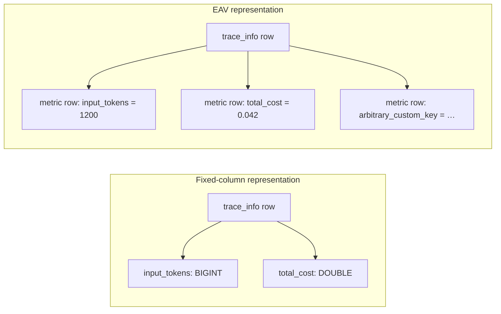
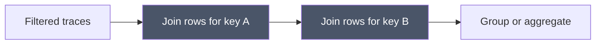

# Entity-attribute-value model

> [!definition]
> The entity-attribute-value model stores properties as `(entity, attribute, value)` rows instead of fixed typed columns. It is useful when attributes are sparse, numerous, or user-defined, but moves schema work into data: type interpretation, constraints, joins, and multi-attribute predicates become runtime responsibilities.

## Mental model

A conventional relational row places the schema in column definitions:

```text
trace_info(request_id, status, input_tokens, total_cost)
```

An EAV table places attribute names beside the values:

```text
trace_metrics(request_id, key, value)
```



EAV provides an open attribute namespace without adding columns. The cost is that the database sees `value` as one generic domain even when the application interprets different keys as integers, floats, booleans, or strings.

## Query mechanics

A single EAV attribute can be indexed by `(entity_id, key)` or `(key, value)`. Queries involving several attributes need multiple filtered joins, conditional aggregation, or repeated `EXISTS` predicates.

```sql
SELECT ti.request_id, SUM(tm.value)
FROM trace_info AS ti
JOIN trace_metrics AS tm
  ON tm.request_id = ti.request_id
WHERE ti.experiment_id = :experiment_id
  AND ti.timestamp_ms >= :start_ms
  AND tm.key = 'input_tokens'
GROUP BY ti.request_id;
```

The trace predicate first identifies entities, then the join expands them into metric rows, the key predicate discards unrelated metrics, and the remaining values are aggregated. At large cardinality, this can require substantial index traversal, join work, and memory even when the final result is small.

For two independent keys, joining the EAV table twice can multiply intermediate work:



## Concrete example

Token metrics are configurable enough to fit `trace_metrics`, but RFC 0006 establishes five reserved token keys as fixed analytics vocabulary. Keeping them in EAV storage requires every dashboard query to rediscover their types and join them back to traces. Promoting them to typed `trace_info` columns allows the experiment/time predicate and metric aggregation to operate on one row set.

Custom user metrics remain in EAV storage because their names and cardinality are not bounded by the product schema. This is a hybrid design: fixed columns for stable hot fields, EAV for the open extension surface.

## EAV, JSON, and fixed columns

| Property | Fixed columns | JSON column | EAV rows |
| --- | --- | --- | --- |
| Schema enforcement | Strong | Partial or expression-based | Application/key-specific |
| Sparse attributes | Wastes null columns | Efficient | Efficient |
| Unknown keys | Schema change required | Natural | Natural |
| Single-row retrieval | Direct | Direct plus extraction | Join or separate lookup |
| Cross-entity analytics | Strong | Expression/index dependent | Join and key-filter dependent |
| Per-key indexes | Direct | Expression/generated-column indexes | Composite or partial indexes |
| Type safety | Native SQL types | JSON type checks | Usually key-dependent coercion |

## Boundaries and pitfalls

- EAV is not inherently incorrect. It is appropriate for genuinely open, sparse metadata where queries usually retrieve properties for one entity.
- Indexing `(key, value)` does not recover native type semantics when heterogeneous values share one column.
- Encoding values as text makes numeric ordering and range predicates incorrect unless conversion occurs first.
- EAV makes uniqueness rules such as “one value for this reserved key per entity” depend on composite constraints and application behavior.
- Promoting every observed key to a column replaces EAV flexibility with uncontrolled schema growth. Promotion should require stable semantics, bounded vocabulary, and measured query value.
- Cleanup after promotion must preserve one [[Authoritative data representation]]; leaving both representations writable creates divergence.

## In the work

[[2026-07-31 - Implement RFC 0006 PostgreSQL trace analytics optimization]] retains EAV for custom metrics while promoting reserved token, cost, name, session, model/provider, and assessment-aggregation fields. The decision is driven by query frequency and semantic stability rather than a blanket rejection of EAV.

## Related concepts

- [[Database denormalization]]
- [[Authoritative data representation]]
- [[Database index]]
- [[Query execution plan]]
- [[Database backfill]]

## Further reading

- [MLflow RFC 0006: current storage and query shape](https://github.com/mlflow/rfcs/blob/main/rfcs/0006-postgres-optimizations/0006-traces-optimizations.md#current-storage-and-query-shape)

