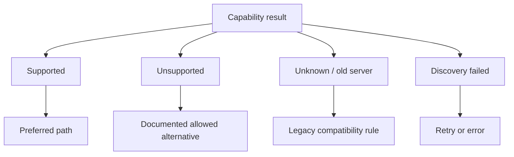

# Fallback behavior

> [!definition]
> Fallback behavior selects an older, simpler, or alternate path when the preferred path is unavailable.

Fallback supports [[Backward compatibility]], but it can also hide defects or violate policy. A safe design defines exactly which evidence permits it.

## Decision table

| Situation | Safe default |
|---|---|
| Old server has no discovery endpoint | Use documented legacy behavior |
| Server explicitly supports presigned transfer | Use [[Presigned URLs]] |
| Server explicitly requires presigned transfer | Never use legacy proxy |
| Server explicitly says capability unsupported | Use legacy only if policy permits |
| Discovery returns transient 500 or network error | Surface or retry; do not silently reinterpret policy |
| New transfer fails after partially writing data | Clean up and follow operation-specific retry rules |

## Why “unknown” differs from “no”

Treating all non-success cases as “use legacy” creates a fail-open system. A server might be temporarily unable to advertise that legacy transfer is forbidden.

## Questions for every fallback

- Which exact error or response triggers it?
- Is the alternate path semantically equivalent?
- Could it weaken [[Authorization]] or another security guarantee?
- Is the operation safe to retry?
- Will telemetry reveal that fallback occurred?
- When can the fallback be removed?

## Avoid fallback loops

The client should not bounce indefinitely between new and legacy paths. Record the chosen policy for one operation, cap retries, and return the most actionable error.

## In the MLflow work

[[2026-07-26 - Add presigned artifact UI support]] preserves legacy behavior for old servers but prevents fallback when `/server-info` says presigned transfer is required. Even small uploads must perform [[Capability negotiation]].

## Related concepts

- [[Backward compatibility]]
- [[Capability negotiation]]
- [[Fail-fast validation]]
- [[Authorization]]
- [[HTTP 426 Upgrade Required]]

