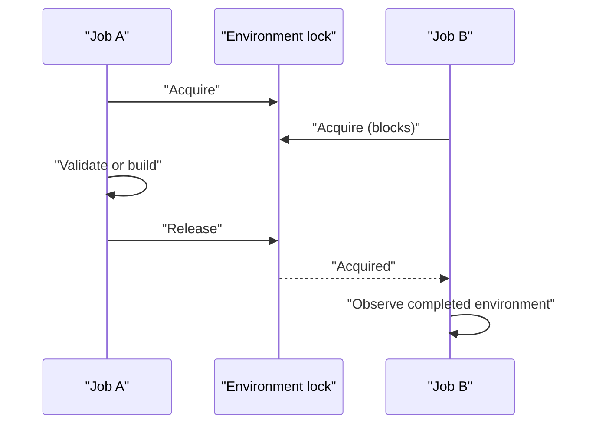

# File locking

> [!definition]
> File locking coordinates access to a file or file-backed resource. It is a form of [[Mutual exclusion]] that can work across separate processes, not only threads inside one process.

## Advisory locking

Most Unix file locks are **advisory**: cooperating programs request and respect the lock, but the kernel does not prevent unrelated code from ignoring it and accessing the file.

```python
import fcntl

with open(lock_path, "w") as lock_file:
    fcntl.flock(lock_file, fcntl.LOCK_EX)
    prepare_shared_environment()
    fcntl.flock(lock_file, fcntl.LOCK_UN)
```

The operating system normally releases the lock when the owning file descriptor is closed or the process exits. That prevents the lock itself from remaining forever after a crash. It does **not** repair partially written data.

## What a lock guarantees

If every participant follows the same protocol, an exclusive lock provides a critical section:



It does not by itself guarantee:

- that writes reached durable storage;
- that the protected operation completed;
- that non-cooperating processes stayed out;
- that a network filesystem implements identical semantics.

Those are [[Crash consistency]] and storage-protocol concerns.

## Lock scope

A lock should cover the invariant, not just one write. For shared setup, the critical section is usually:

1. inspect completion state;
2. remove or repair incomplete state;
3. perform setup;
4. mark setup complete.

Releasing between these steps lets another process observe a state that is neither safely old nor fully new.

## In the MLflow work

[[2026-07-28 - Implement LocalJobExecutor]] uses a file lock so two jobs do not construct the same environment concurrently. An incomplete marker handles the separate problem of a process dying partway through construction.

## Related concepts

- [[Mutual exclusion]]
- [[Crash consistency]]
- [[Idempotent setup]]
- [[Durable state]]
- [[Atomic filesystem operation]]

## Further reading

- [Python `fcntl.flock`](https://docs.python.org/3/library/fcntl.html#fcntl.flock)

