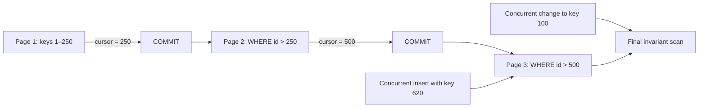

# Keyset pagination

> [!definition]
> Keyset pagination fetches the next page using the last seen value of a stable, ordered key rather than counting and skipping earlier rows. It is also called seek or cursor pagination and is well suited to bounded scans of large, changing tables.

## Mental model

Instead of saying “skip the first 50,000 rows,” say “continue strictly after key 50,000.” With a suitable index, the database seeks to the boundary and reads the next range.

```sql
SELECT id
FROM traces
WHERE id > :last_id
ORDER BY id
LIMIT :batch_size;
```

For a non-unique ordering such as `(created_at, id)`, the cursor must include both values and comparison must be lexicographic. The unique tie-breaker prevents duplicates or omissions among equal timestamps.



The cursor bounds traversal; it does not prove that previously visited rows stayed correct.

## Concrete example

A backfill reads IDs `1..250`, updates and commits them, then stores `250` as its in-memory cursor. The next query asks for `id > 250 LIMIT 250`. If rows `1..100` are deleted, the next page is unaffected. An offset-based query could shift because its meaning depends on how many earlier rows currently exist.

For durable correctness, the cursor alone is insufficient. If row 100 changes after its batch, a final [validation](Data%20migration%20validation.md) or repair pass must rediscover it.

## Boundaries and pitfalls

- The ordering key must be stable. Updating the key during traversal can move a row across the cursor.
- The order must be total; add a unique tie-breaker when the main sort value is not unique.
- Newly inserted rows behind the cursor may be missed, so live backfills need a catch-up invariant.
- Keyset pagination does not support arbitrary “jump to page N” behavior efficiently; that is usually irrelevant for a sequential worker.
- Composite cursors require careful null handling and the same sort direction in every comparison.

## In the work

Revision `75868b020152` uses bounded, key-oriented migration behavior. For [2026-07-31 - Prepopulate denormalized trace analytics](../Tasks/2026-07-31%20-%20Prepopulate%20denormalized%20trace%20analytics.md), keyset pagination is the natural traversal mechanism because it avoids increasingly expensive offsets and creates clear batch boundaries.

## Related concepts

- [Database backfill](Database%20backfill.md)
- [Database index](Database%20index.md)
- [Transaction boundary](Transaction%20boundary.md)
- [Data migration validation](Data%20migration%20validation.md)
- [Idempotency](Idempotency.md)

## Further reading

- [PostgreSQL documentation: LIMIT and OFFSET](https://www.postgresql.org/docs/current/queries-limit.html)
