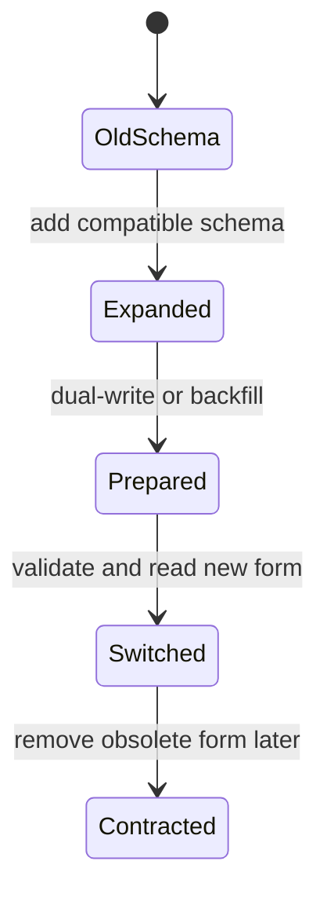

# Online schema migration

> [!definition]
> An online schema migration changes database structure or representation while application traffic continues. It separates a risky all-at-once change into compatible phases so old and new code and partially migrated data can coexist until a validated cutover.

## Mental model

A common pattern is expand, prepare, switch, contract:

The phases deliberately overlap. During the overlap, software must tolerate mixed state. The more expensive the historical rewrite, the more useful it is to separate that [[Database backfill]] from the short, controlled upgrade step.

“Zero downtime” does not mean zero load or zero locking. It means the design keeps disruption within an accepted operational envelope while requests continue.

## Concrete example

For a new `user_id` column derived from a metadata table:

1. Add the nullable column without requiring every historical row to be rewritten immediately.
2. Deploy code that keeps the new column correct for new or changed rows while retaining [[Backward compatibility]].
3. Populate historical rows in bounded batches.
4. Run a final migration that catches residual work and performs [[Data migration validation]].
5. Switch reads to the new column when its invariant is trustworthy.
6. Remove compatibility paths only in a later, separately safe phase.

## Boundaries and pitfalls

- DDL behavior varies by database engine and version; an apparently simple alteration may scan or lock a large table.
- Dual-write logic can diverge if the old and new representations do not share one derivation rule.
- A backfill completion timestamp is not proof of completeness when writes continued concurrently.
- Adding a non-null constraint too early can turn a compatible expansion into an outage.
- Rollback must consider data representation, not only application binaries; old code may not understand values written by new code.

## In the work

[[2026-07-31 - Prepopulate denormalized trace analytics]] is the “prepare” phase of an online migration. The prepopulation utility reduces synchronous upgrade work, but the Alembic revision remains responsible for catch-up and validation before the new analytics representation is trusted.

## Related concepts

- [[Database backfill]]
- [[Backward compatibility]]
- [[Idempotency]]
- [[Transaction boundary]]
- [[Data migration validation]]

## Further reading

- [MLflow PR #24588: SQL trace analytics schema migration](https://github.com/mlflow/mlflow/pull/24588)
- [Martin Fowler: Parallel Change](https://martinfowler.com/bliki/ParallelChange.html)

