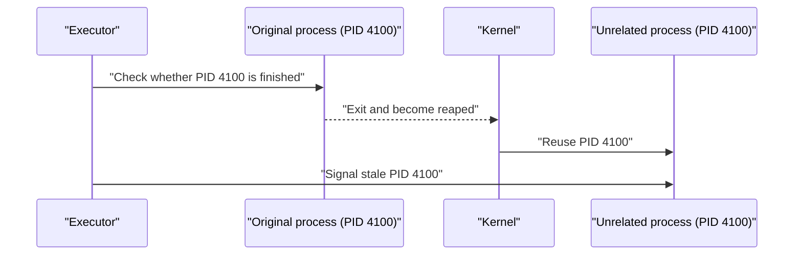

# PID reuse

> [!definition]
> PID reuse occurs when the operating system assigns a numeric [[Process ID]] from a terminated, reaped [[Process]] to a later, unrelated process.

A PID identifies a process only during that process's lifetime. It is not a permanent identity.

## The stale-identity hazard



The dangerous gap is a [[TOCTOU race]]: the executor checks one fact, the system changes, and the executor later acts as if the old fact were still true.

## Risky pattern

```python
if process.poll() is None:
    # Time passes here. The checked identity may no longer be current.
    os.killpg(process.pid, signal.SIGKILL)
```

The exact risk depends on what `poll()` did, which identifiers are reused, and whether the supposed [[POSIX process groups|process group]] still exists. The broader lesson is not to split identity validation and destructive action across an unprotected interval.

## Mitigation strategies

- Serialize lifecycle decisions with [[Mutual exclusion]] so competing executor threads cannot independently complete and cancel the same record.
- Keep the check and signal as one small critical operation.
- Validate structural facts—for example, that a process is still the expected group leader—immediately before signaling.
- Prefer stable kernel handles where the platform supplies them; a raw integer PID is weaker.
- Make signaling helpers report whether they actually delivered a signal, then reconcile with the authoritative process result.

No user-space technique can make an integer PID globally permanent. The goal is to reduce the window and make incorrect state transitions impossible even if signaling loses a race.

## In the MLflow work

[[2026-07-28 - Implement LocalJobExecutor]] keeps process-state inspection and group signaling coordinated under the executor's record lock. It avoids a separate `poll()` immediately before signaling and checks that the expected leader still owns the group.

## Related concepts

- [[Process ID]]
- [[Process reaping]]
- [[POSIX process groups]]
- [[TOCTOU race]]
- [[Cancellation races]]
- [[Mutual exclusion]]

## Further reading

- [POSIX process ID and process-group ID definitions](https://pubs.opengroup.org/onlinepubs/9799919799/basedefs/V1_chap03.html)

