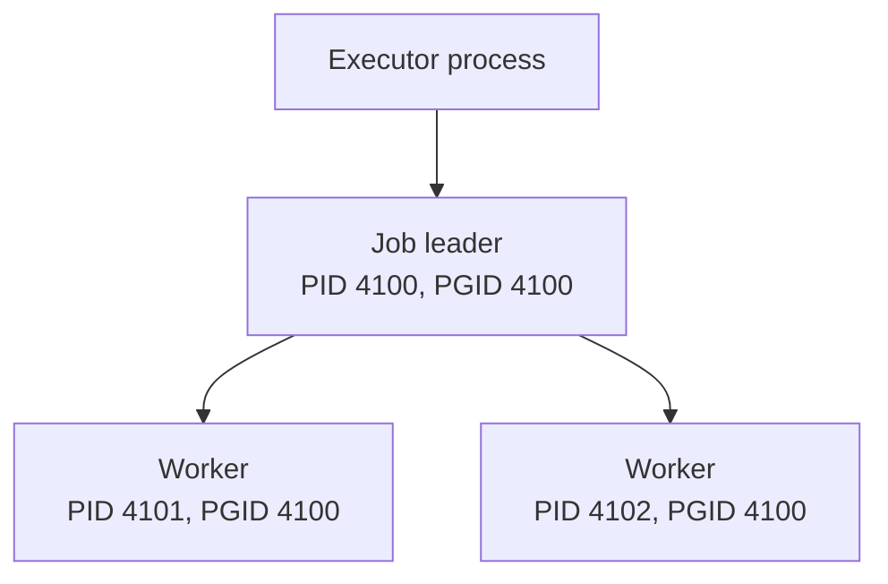

# POSIX process groups

> [!definition]
> A POSIX process group is a collection of related [processes](Process.md) that the operating system can address with one [signal](Unix%20signal.md). The group is identified by a process-group ID, or PGID.

Every process has a [PID](Process%20ID.md) and belongs to exactly one process group. A process-group leader has `PID == PGID`. A new [child process](Child%20process.md) normally inherits its parent's group.

## Why groups matter

Killing one process does not automatically kill the processes it started:



Sending a signal to PID `4100` targets only the job leader. Sending it to PGID `4100` targets all three members. This is why process groups are useful for shells, terminal job control, and executors such as [2026-07-28 - Implement LocalJobExecutor](../Tasks/2026-07-28%20-%20Implement%20LocalJobExecutor.md).

## Python example

```python
import os
import signal
import subprocess

process = subprocess.Popen(
    ["python", "job.py"],
    start_new_session=True,
)

# The new session also gives the child a new process group whose PGID
# is normally the child's PID.
os.killpg(process.pid, signal.SIGTERM)

# Reap the direct child after it exits.
process.wait()
```

`start_new_session=True` asks the child to call `setsid()` before executing the program. That makes it the leader of a new [POSIX session](POSIX%20session.md) and a new process group. `os.killpg()` sends the signal to the group.

## Boundaries

- This is POSIX behavior; Windows uses different process-management mechanisms.
- A descendant can escape by creating another session or changing its process group.
- The parent still owns only its direct child and must perform [Process reaping](Process%20reaping.md).
- A numeric PGID can later be reused, so signaling must account for [PID reuse](PID%20reuse.md).
- A group handles *which processes receive a signal*. It does not decide the correct terminal job state; that belongs to [cancellation semantics](Cancellation%20races.md).

## In the MLflow work

The local executor starts both environment-setup commands and final job commands in their own groups. Cancellation, timeout, recovery, and shutdown can then signal the inherited descendants rather than leaving grandchildren running.

## Related concepts

- [Process](Process.md)
- [Process ID](Process%20ID.md)
- [Child process](Child%20process.md)
- [POSIX session](POSIX%20session.md)
- [Unix signal](Unix%20signal.md)
- [Process reaping](Process%20reaping.md)
- [PID reuse](PID%20reuse.md)

## Further reading

- [POSIX definitions: process group, process-group ID, and process](https://pubs.opengroup.org/onlinepubs/9799919799/basedefs/V1_chap03.html)
- [Python `subprocess` documentation](https://docs.python.org/3/library/subprocess.html)
- [Python `os.killpg`](https://docs.python.org/3/library/os.html#os.killpg)

