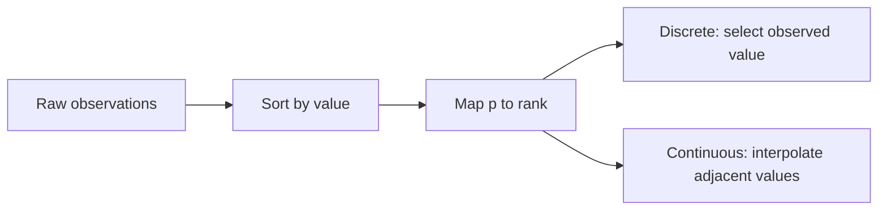
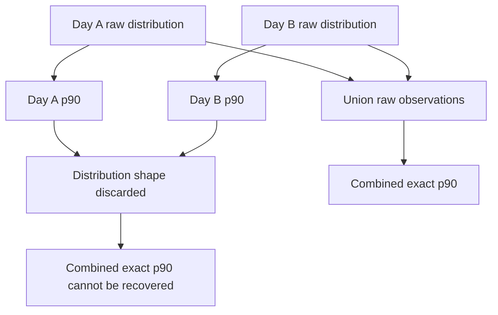

# Percentile aggregation

> [!definition]
> A percentile is an order statistic describing a position in a distribution: the p90 is a value at or below which approximately 90% of observations fall under a specified interpolation rule. Exact percentile computation requires distribution information that a single percentile scalar does not preserve, so exact percentiles are not generally composable across partitions.

## Mental model: rank and interpolation

For sorted observations `x₁ ≤ x₂ ≤ … ≤ xₙ`, a percentile implementation maps probability `p` to a rank and applies a selection or interpolation rule. SQL engines distinguish discrete percentiles, which return an observed value, from continuous percentiles, which may interpolate between adjacent observations.



The rule is part of the semantics. Two systems can both report “p90” and differ because of null handling, interpolation, sample definition, or inclusive/exclusive rank conventions.

## Concrete example: why percentile scalars do not compose

Consider two equal-sized daily partitions:

```text
Day A: 0, 0, 0, 0, 100
Day B: 10, 10, 10, 10, 10
```

Depending on the exact percentile rule, each day can be summarized near `100` and `10`. Computing the percentile of those two summaries does not reconstruct the combined ordered values:

```text
Combined: 0, 0, 0, 0, 10, 10, 10, 10, 10, 100
```

The daily scalars omit sample counts around the rank and the shape between observed points. Unequal partition sizes make the error more obvious: a one-row day and a million-row day would receive equal influence if their percentiles were simply averaged.



## Exact and approximate merge state

| Representation | Mergeable | Exact | Typical cost |
| --- | --- | --- | --- |
| One percentile scalar | No | Only for its original sample | Constant storage |
| Full sorted observations | Yes | Yes | Storage proportional to samples |
| Exact frequency map | Yes | Yes | Storage proportional to distinct values |
| Histogram | Yes with shared buckets | Usually approximate | Bounded by bucket count |
| Quantile sketch | Yes if algorithm supports merge | Approximate | Bounded probabilistic state |

Approximate structures such as t-digest or KLL can be mergeable, but they introduce an accuracy contract and implementation-specific error behavior. They cannot replace an exact API without making that semantic change explicit.

## Concrete RFC 0006 routing

RFC 0006 stores daily p50, p90, and p99 values for trace metrics where PostgreSQL can construct them. Readers use those values only when the request exactly matches:

- one experiment;
- complete UTC-day buckets;
- a supported percentile value;
- a backend with populated percentile rollups;
- valid rollup partitions with no rebuild marker.

Multi-day requests still consist of individual daily buckets, so each stored daily percentile is returned for its matching day. An unbucketed percentile across several days, a multi-experiment percentile, or an unsupported backend remains on the raw path.

## Boundaries and pitfalls

- Averaging p90 values is not a p90.
- Weighting daily p90 values by daily count still does not recover the distribution.
- Merging histograms is valid only when bucket definitions and value domains are compatible.
- Approximation error should be stated in rank or value terms and tested on skewed distributions.
- Null, non-finite, and type-coercion rules must match between raw and rollup construction.
- A valid stored percentile can become stale after a late write and therefore still requires [Rollup invalidation](Rollup%20invalidation.md).

## In the work

[2026-07-31 - Implement RFC 0006 PostgreSQL trace analytics optimization](../Tasks/2026-07-31%20-%20Implement%20RFC%200006%20PostgreSQL%20trace%20analytics%20optimization.md) keeps exact percentile semantics by restricting rollup eligibility instead of trying to combine daily percentile scalars. Unsupported shapes fall back to raw queries.

## Related concepts

- [Database rollup table](Database%20rollup%20table.md)
- [Rollup invalidation](Rollup%20invalidation.md)
- [Query execution plan](Query%20execution%20plan.md)
- [Data migration validation](Data%20migration%20validation.md)

## Further reading

- [PostgreSQL documentation: ordered-set aggregate functions](https://www.postgresql.org/docs/current/functions-aggregate.html)
