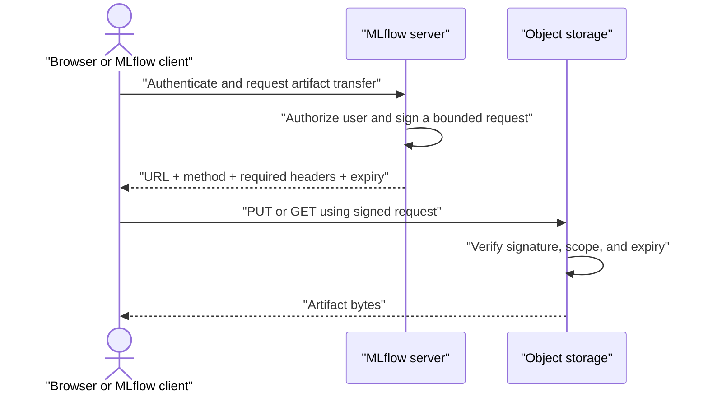

# Presigned URLs

> [!definition]
> A presigned URL is a time-limited URL containing a cryptographic signature that authorizes a specific HTTP request to a storage resource.

It lets a browser or client transfer data directly to object storage without receiving the signer's long-lived credentials.

## Request flow



The control plane—the MLflow server—still performs [[Authentication]] and [[Authorization]]. The data plane—the object store—handles the large byte transfer.

## What is usually bound by the signature

Depending on the provider and signing scheme:

- HTTP method such as `GET` or `PUT`;
- bucket, key, and region;
- expiration time;
- selected headers and query parameters;
- sometimes content type, checksum, or upload constraints.

Changing a signed property normally invalidates the request.

## Security model

A presigned URL behaves like a temporary bearer capability: anyone who obtains it can usually perform the signed action until it expires or its underlying credentials become invalid.

Practical rules:

- use short expirations appropriate to the operation;
- never place URLs in ordinary application logs or analytics;
- use HTTPS;
- restrict the signed method and object key;
- avoid returning broader permissions than the current user has;
- account for browser CORS configuration;
- regenerate after expiry instead of keeping URLs in long-lived caches.

The URL does not grant more authority than the signing credentials possess, but leaking it delegates the included authority to the holder.

## Upload example

```python
# Control plane
signed = storage.create_presigned_upload(
    path="runs/123/artifacts/model.pkl",
    expires_in=300,
)
return {"url": signed.url, "method": "PUT", "headers": signed.headers}
```

```typescript
// Data plane
await fetch(url, {
  method: 'PUT',
  headers,
  body: file,
});
```

## Why MLflow needs negotiation

Not every artifact backend can generate signed URLs, and older servers do not advertise them. [[2026-07-26 - Add presigned artifact UI support]] therefore combines presigned transfer with [[Capability negotiation]], [[Fail-fast validation]], and controlled [[Fallback behavior]].

## Related concepts

- [[Authentication]]
- [[Authorization]]
- [[Capability]]
- [[Capability negotiation]]
- [[Streaming HTTP downloads]]
- [[Configuration ownership]]

## Further reading

- [Amazon S3: download and upload objects with presigned URLs](https://docs.aws.amazon.com/AmazonS3/latest/userguide/using-presigned-url.html)
- [AWS: presigned URL best-practice overview](https://docs.aws.amazon.com/prescriptive-guidance/latest/presigned-url-best-practices/overview.html)

