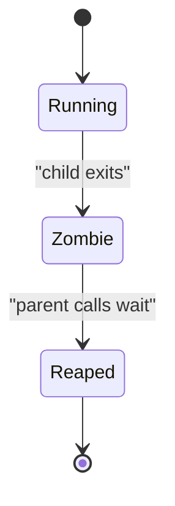

# Process reaping

> [!definition]
> Process reaping is the act of a parent collecting the termination status of a [child](Child%20process.md), usually with a wait operation.

Exiting and being fully removed are separate steps on POSIX systems:



A child that has exited but has not been waited for is a **zombie process**. It no longer runs code, but the kernel retains a small record containing its [PID](Process%20ID.md) and exit status so the parent can inspect it.

## Python interfaces

| Operation | Waits? | Collects exit status? | Handles output pipes? |
|---|---:|---:|---:|
| `Popen.poll()` | No | Yes, if already exited | No |
| `Popen.wait()` | Yes | Yes | No |
| `Popen.communicate()` | Yes | Yes | Yes |

```python
process = subprocess.Popen(["python", "job.py"])

try:
    return_code = process.wait(timeout=30)
except subprocess.TimeoutExpired:
    process.kill()
    return_code = process.wait()  # termination and reaping are both required
```

If stdout or stderr are pipes, blindly waiting can deadlock when the child fills a pipe buffer. `communicate()` is normally safer when the parent must consume captured output.

## Reaping is not termination

These operations solve different problems:

- A [Unix signal](Unix%20signal.md) asks or forces a process to stop.
- [POSIX process groups](POSIX%20process%20groups.md) let one signal reach related descendants.
- Reaping collects the direct child's exit status after it stops.

Even after signaling an entire process group, the executor should still wait for the `Popen` object it created.

## Concurrency complication

`poll()` can reap an already-finished child. That is usually useful, but a lifecycle controller must consider what happens between checking completion and signaling. Once the child has been reaped, its numeric PID may become available for [PID reuse](PID%20reuse.md), creating a [TOCTOU race](TOCTOU%20race.md) if the code later acts on the stale number.

## In the MLflow work

[2026-07-28 - Implement LocalJobExecutor](../Tasks/2026-07-28%20-%20Implement%20LocalJobExecutor.md) signals the job's process group and then reaps the direct child. Its coordination deliberately avoids turning `poll()` into a separate unsafe check before group signaling.

## Related concepts

- [Process](Process.md)
- [Child process](Child%20process.md)
- [Process ID](Process%20ID.md)
- [Unix signal](Unix%20signal.md)
- [POSIX process groups](POSIX%20process%20groups.md)
- [PID reuse](PID%20reuse.md)

## Further reading

- [Python `Popen.poll`, `wait`, and `communicate`](https://docs.python.org/3/library/subprocess.html#popen-objects)
- [POSIX process and zombie-process definitions](https://pubs.opengroup.org/onlinepubs/9799919799/basedefs/V1_chap03.html)

