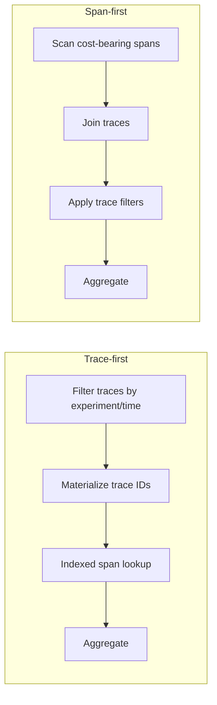

# Query execution plan

> [!definition]
> A query execution plan is the database engine's chosen sequence of scans, joins, filters, sorts, aggregates, and materialization steps for a SQL statement. Logically equivalent SQL can produce materially different runtime and resource use because the optimizer estimates cardinality and chooses different physical operators.

## Mental model

SQL defines a result, not a procedural execution order. The optimizer uses table statistics, predicates, available [[Database index|indexes]], estimated row counts, and cost rules to choose a plan.

For a trace-filtered span aggregate, two logical options are:

If the trace predicate is highly selective, the trace-first plan reduces span work. If most traces qualify, materialization and repeated lookups may cost more than a broad scan. The correct shape is workload-dependent and must be measured with representative cardinalities.

## Concrete example

RFC 0006 builds a `metric_trace_ids` CTE containing the filtered trace set and marks it `MATERIALIZED` on PostgreSQL. The materialization creates an optimization boundary: PostgreSQL computes the filtered IDs before joining spans instead of inlining the CTE and returning to the slower span-first plan observed in the prototype.

Plan verification should compare `EXPLAIN (ANALYZE, BUFFERS)` output for:

- estimated versus actual rows at each node;
- index scans versus sequential scans;
- join order and join algorithm;
- rows removed by late filters;
- materialization size;
- buffer hits, reads, temporary I/O, and total execution time.

## Boundaries and pitfalls

- A faster plan on a small development database can become slower at production cardinality.
- Stale statistics produce bad cardinality estimates even when suitable indexes exist.
- `MATERIALIZED` prevents optimizer freedom; it is useful when measurements prove the boundary, not as a general rule.
- An index is not automatically selected and can make low-selectivity queries slower.
- Planning time, execution time, cache state, concurrent load, and parameter values must be separated in benchmarks.
- A median from repeated execution does not describe tail latency or lock contention.

## In the work

[[2026-07-31 - Implement RFC 0006 PostgreSQL trace analytics optimization]] requires a PostgreSQL-specific trace-first plan for raw span-cost queries. The RFC explicitly rejects `generate_series + LATERAL` after it performed worse than grouped or parallel scans on the benchmark dataset.

## Related concepts

- [[Database index]]
- [[Database denormalization]]
- [[Database rollup table]]
- [[Entity-attribute-value model]]

## Further reading

- [PostgreSQL documentation: Using EXPLAIN](https://www.postgresql.org/docs/current/using-explain.html)
- [PostgreSQL documentation: WITH query materialization](https://www.postgresql.org/docs/current/queries-with.html#QUERIES-WITH-CTE-MATERIALIZATION)

