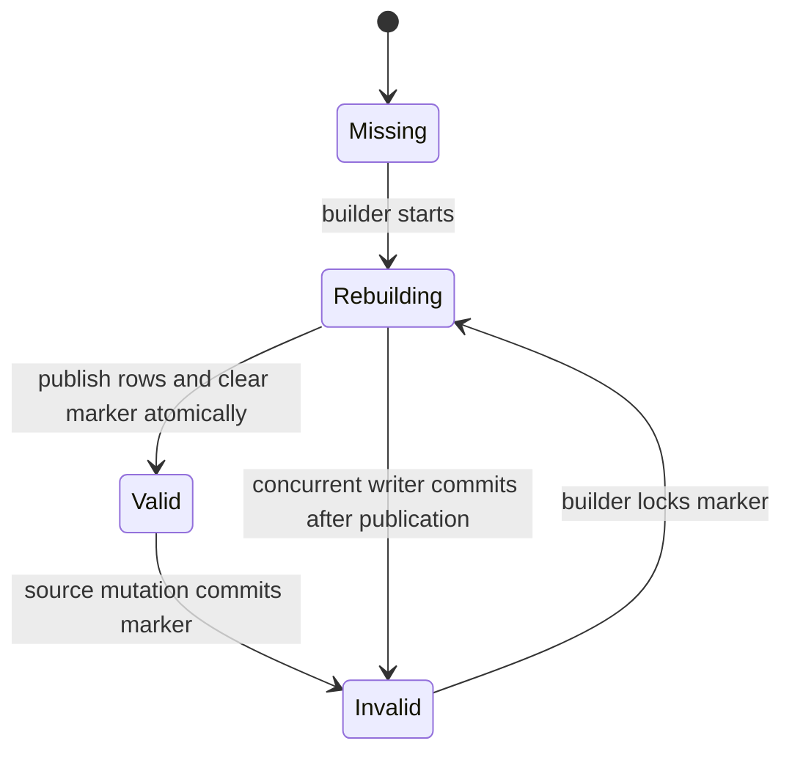

# Rollup invalidation

> [!definition]
> Rollup invalidation records that a materialized aggregate no longer safely represents its source rows. A correct invalidation protocol makes stale state ineligible for reads, survives crashes, covers old and new partitions for moves, and coordinates source writes with aggregate publication.

## Mental model

An aggregate has three relevant states:

Queue-row presence is a negative validity signal. A reader can use a rollup partition only when matching aggregate rows exist and no invalidation row exists. This rule turns a crash-resistant database row into a simple routing predicate.

The source mutation and invalidation must share a [Transaction boundary](Transaction%20boundary.md). If source data commits without its marker, readers may serve stale aggregates. If the marker commits without the source change, the result is extra rebuild work but remains correct.

## Concrete example

A trace moves from experiment A on Monday to experiment B on Tuesday. The write can change:

- the old trace partition A/Monday;
- the new trace partition B/Tuesday;
- related assessment partitions derived from trace time;
- span-cost partitions based on span timestamps.

The transaction inserts deduplicated rebuild entries for every affected old and new family partition. Old partitions must be marked even if the move removes their last source row, because scanning current source rows cannot rediscover an empty former partition.

During rebuild, the builder locks the queue row, computes replacement rollups, publishes them, and deletes the marker atomically. A racing writer locks or upserts the same key and leaves a marker after publication, so the newly stale rollup is not served.

## Boundaries and pitfalls

- A time-based “old data is immutable” assumption fails for delayed spans, backdated traces, corrections, deletes, and experiment moves.
- Invalidating only the destination of a move leaves the source aggregate overstated.
- Deleting the queue marker before rollup publication exposes missing or partially replaced aggregates.
- An in-memory work queue loses correctness signals on restart and cannot repair empty old partitions.
- Partition-level locks avoid a global bottleneck, but a hot partition can still serialize writers and rebuilds.
- A maximum rebuilds-per-run setting bounds load but increases the interval during which affected reads use the raw path.

## In the work

RFC 0006 defines `sql_trace_rollup_rebuild_queue` keyed by workspace, experiment, UTC day, and rollup family. [2026-07-31 - Implement RFC 0006 PostgreSQL trace analytics optimization](../Tasks/2026-07-31%20-%20Implement%20RFC%200006%20PostgreSQL%20trace%20analytics%20optimization.md) requires all application replicas to enqueue invalidations while a single scheduled worker rebuilds partitions.

## Related concepts

- [Database rollup table](Database%20rollup%20table.md)
- [Transaction boundary](Transaction%20boundary.md)
- [Authoritative data representation](Authoritative%20data%20representation.md)
- [Data migration validation](Data%20migration%20validation.md)
- [Idempotency](Idempotency.md)

## Further reading

- [MLflow RFC 0006: invalidation and rebuild](https://github.com/mlflow/rfcs/blob/main/rfcs/0006-postgres-optimizations/0006-traces-optimizations.md#invalidation-and-rebuild)

