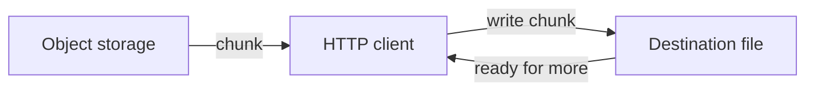

# Streaming HTTP downloads

> [!definition]
> A streaming HTTP download consumes response bytes incrementally instead of buffering the entire object in memory before processing it.



## Basic Python shape

```python
with httpx.stream("GET", signed_url) as response:
    response.raise_for_status()
    with open(destination, "wb") as output:
        for chunk in response.iter_bytes():
            output.write(chunk)
```

Memory use is approximately bounded by the chunk and library buffers rather than artifact size.

## `Content-Length` is helpful, not always required

[Content-Length](Content-Length.md) enables:

- progress percentages;
- early capacity checks;
- some integrity and truncation checks;
- preallocation optimizations.

But HTTP can carry a response without a known length, for example when generated dynamically or framed by the protocol. A client that can stream until end-of-response does not need a separate `file_size` field merely to write the bytes.

## Backpressure

[Backpressure](Backpressure.md) is the mechanism by which a slow consumer limits how quickly upstream data is accepted. Awaiting each read/write cycle naturally provides some flow control. If code launches unbounded writes or queues chunks indefinitely, it loses the memory benefit of streaming.

## Failure handling

- Write to a temporary file and publish with an [Atomic filesystem operation](Atomic%20filesystem%20operation.md) after success.
- Clean up partial output on failure.
- Set connection and read timeouts.
- Decide whether retries restart the download or use HTTP range requests.
- Verify checksum or expected size when supplied.
- Avoid logging a [presigned URL](Presigned%20URLs.md).

## Browser considerations

Browser media elements can often stream from a URL directly. If JavaScript fetches the response, CORS policy must expose required headers and allow the origin. Object URLs should be revoked when no longer needed.

## In the MLflow work

[2026-07-26 - Add presigned artifact UI support](../Tasks/2026-07-26%20-%20Add%20presigned%20artifact%20UI%20support.md) accepts a valid signed download response without `file_size` and streams until completion instead of rejecting the transfer.

## Related concepts

- [Backpressure](Backpressure.md)
- [Content-Length](Content-Length.md)
- [Presigned URLs](Presigned%20URLs.md)
- [Atomic filesystem operation](Atomic%20filesystem%20operation.md)
- [HTTP status code](HTTP%20status%20code.md)

