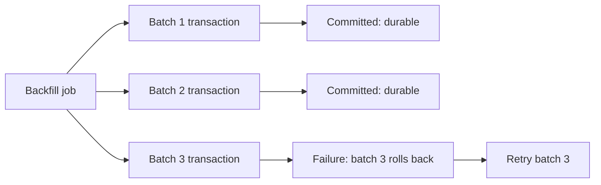

# Transaction boundary

> [!definition]
> A transaction boundary defines the database operations that commit or roll back as one atomic unit. It also determines lock lifetime, snapshot lifetime, visibility to concurrent transactions, retry granularity, transaction-log volume, and how much completed work survives process failure.

## Mental model: atomic unit versus whole operation

A logical operation does not need to be one database transaction. A large [Database backfill](Database%20backfill.md) can be one logical job composed of thousands of independently committed transactions.



This structure sacrifices all-or-nothing behavior for the whole job but bounds the failure and concurrency cost of each unit. [Idempotency](Idempotency.md) and final [Data migration validation](Data%20migration%20validation.md) provide convergence across batches.

## Visibility and concurrency

Inside a transaction, statements execute against a database-defined consistency model. Other transactions generally cannot observe uncommitted writes. Locks acquired by updates usually remain until commit or rollback.

```mermaid
sequenceDiagram
    participant B as Backfill worker
    participant DB as Database
    participant A as Application writer

    B->>DB: BEGIN; select batch
    B->>DB: conditional updates
    A->>DB: update overlapping row
    DB-->>A: wait or conflict according to plan/isolation
    B->>DB: validate batch
    B->>DB: COMMIT
    DB-->>A: continue against committed state
```

The exact outcome depends on statement order, predicates, isolation level, and engine. A transaction does not automatically prevent lost updates: an unconditional backfill update can overwrite an application change after reading older source state. Conditional updates, row locking, optimistic predicates, or recomputation inside the update may be required.

## Batch-size tradeoff

| Larger transaction | Smaller transaction |
| --- | --- |
| Higher throughput and fewer commits | More commit and round-trip overhead |
| Longer lock and snapshot lifetime | Shorter interference window |
| More WAL/redo and replication burst | Smoother incremental replication |
| Larger rollback cost | Smaller retry unit |
| More durable work lost on failure | More progress checkpoints |

Batch size should be exposed as an operational control and benchmarked on representative tables. The migration can choose a conservative default without assuming it fits every deployment.

## Concrete example: coupled state changes

Some writes must share a boundary because separating them creates an unsafe visible state. RFC 0006 requires a source mutation and its [Rollup invalidation](Rollup%20invalidation.md) marker to commit together:

```text
BEGIN
  update source trace/span/assessment row
  upsert every affected rebuild-queue key
COMMIT
```

If the source change commits without invalidation, stale rollups may be served. If invalidation exists without the source change, the system performs an unnecessary rebuild but remains correct. The atomic boundary eliminates both intermediate outcomes under normal commit semantics.

## Boundaries and pitfalls

- One huge transaction can retain dead tuples, delay vacuum, expand logs, hold locks, and create replication lag.
- Committing each row minimizes rollback scope but wastes round trips and increases fixed commit cost.
- Isolation levels control visibility, not application invariants; write predicates still need correct conflict semantics.
- Deadlocks are possible when workers lock the same resources in different orders. Retry must restart the whole failed transaction.
- External effects such as logs, files, or network calls do not roll back with the database transaction.
- Batch progress should be inferred from committed data or a transactionally updated checkpoint, never from an in-memory cursor alone.

## In the work

[2026-07-31 - Prepopulate denormalized trace analytics](../Tasks/2026-07-31%20-%20Prepopulate%20denormalized%20trace%20analytics.md) uses one transaction per bounded keyset batch. The RFC rollup subsystem uses a different boundary: source mutations and rebuild markers commit together, while partition replacement and marker deletion form another atomic unit.

## Related concepts

- [Database backfill](Database%20backfill.md)
- [Keyset pagination](Keyset%20pagination.md)
- [Idempotency](Idempotency.md)
- [Data migration validation](Data%20migration%20validation.md)
- [Rollup invalidation](Rollup%20invalidation.md)

## Further reading

- [PostgreSQL documentation: Transaction isolation](https://www.postgresql.org/docs/current/transaction-iso.html)
