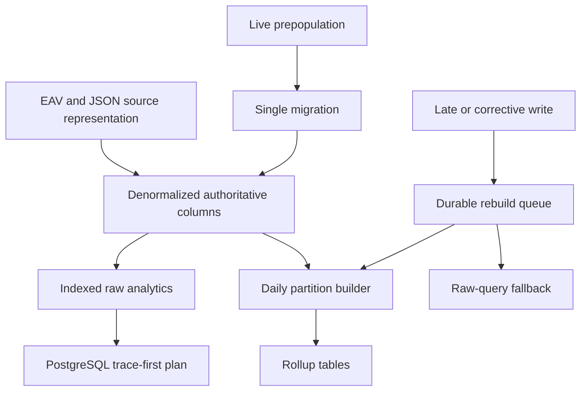
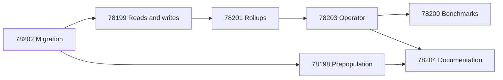

# PostgreSQL trace analytics optimization

Technical map for [2026-07-31 - Implement RFC 0006 PostgreSQL trace analytics optimization](../Tasks/2026-07-31%20-%20Implement%20RFC%200006%20PostgreSQL%20trace%20analytics%20optimization.md).

## Storage and authority

- [Entity-attribute-value model](../Concepts/Entity-attribute-value%20model.md) — current metric, tag, metadata, and dimension storage.
- [Database denormalization](../Concepts/Database%20denormalization.md) — dedicated hot fields on `trace_info`, `spans`, and `assessments`.
- [Authoritative data representation](../Concepts/Authoritative%20data%20representation.md) — stored columns as authority with synthesized compatibility views.
- [Backward compatibility](../Concepts/Backward%20compatibility.md) — legacy API shapes and downgrade reconstruction.

## Raw query path

- [Database index](../Concepts/Database%20index.md) — assessment, span-cost, and rollup lookup access paths.
- [Query execution plan](../Concepts/Query%20execution%20plan.md) — PostgreSQL trace-first planning and the materialized trace-ID CTE.

## Rollup path

- [Database rollup table](../Concepts/Database%20rollup%20table.md) — daily trace, span-cost, and assessment aggregates.
- [Percentile aggregation](../Concepts/Percentile%20aggregation.md) — exactness and the non-composability of daily percentile values.
- [Rollup invalidation](../Concepts/Rollup%20invalidation.md) — durable partition invalidation, locking, publication, and raw fallback.

## Migration path

- [Online schema migration](../Concepts/Online%20schema%20migration.md) — schema expansion, preparation, authoritative switch, and cleanup.
- [Database backfill](../Concepts/Database%20backfill.md) — historical derivation and live prepopulation.
- [Keyset pagination](../Concepts/Keyset%20pagination.md) — stable traversal for bounded updates.
- [Transaction boundary](../Concepts/Transaction%20boundary.md) — per-batch atomicity and operational load control.
- [Idempotency](../Concepts/Idempotency.md) — restart and catch-up semantics.
- [Data migration validation](../Concepts/Data%20migration%20validation.md) — batch and global invariants before cleanup.

## System relationships

## Delivery graph

## Unresolved design boundaries

- Server-side caps for expensive raw query shapes.
- Source-row guard behavior for exact assessment distributions.
- Multi-replica rollup scheduling after RFC 0002.
- Production RHOAI performance and maintenance characteristics.

