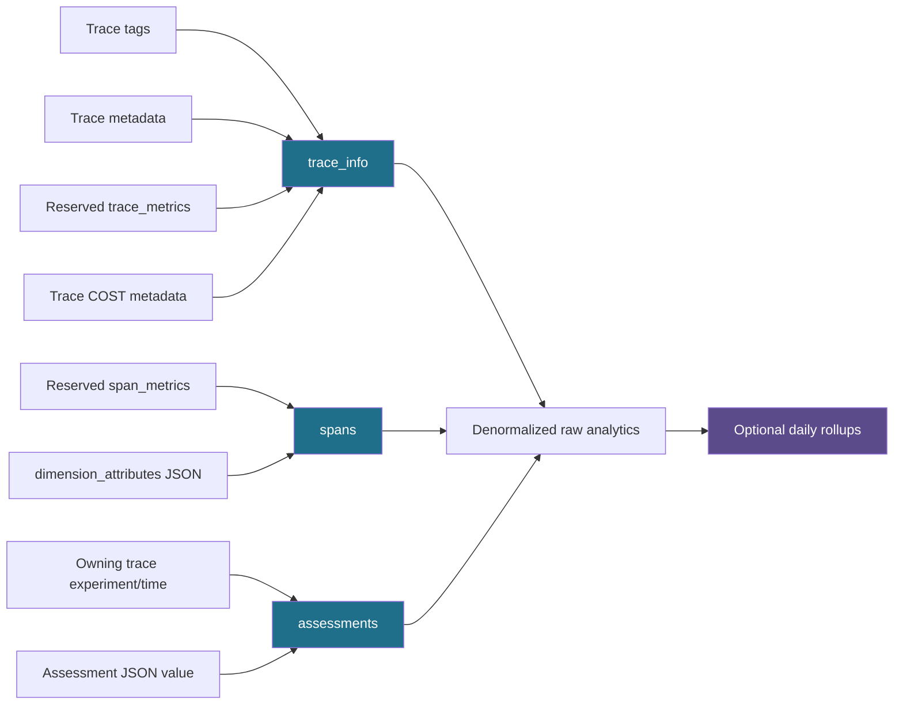
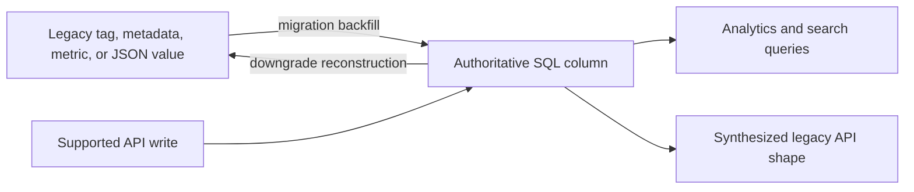
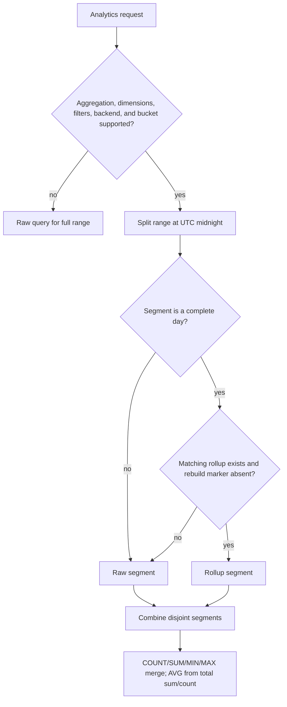
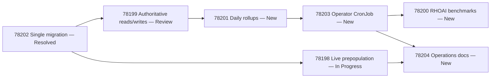

# Implement RFC 0006 PostgreSQL trace analytics optimization

## Context

RHOAIENG-78197 implements MLflow RFC 0006 under RHAISTRAT-2250, “Keep MLflow experiment traces overview interactive at very large scale.” The design keeps the supported SQL databases as the system of record, removes EAV joins from high-volume analytics paths, introduces optional daily summaries, and uses PostgreSQL-specific planning and index features where measurements justify them.

The motivating dataset contains 10 million traces, 30 million spans, and 30 million assessments in one experiment. On that dataset, the current Usage page requires roughly three minutes and several Traces-page metrics time out. The RFC targets seconds rather than minutes without introducing a separate analytics database.

The Jira epic contains seven stories. The implementation is being assembled on the `rfc-0006` feature branch and must use one Alembic migration for the entire feature-branch database change.

## Objective

Deliver RFC 0006 end to end for RHOAI:

- denormalize the high-value trace, span-cost, and assessment fields;
- make the new columns authoritative for supported reads and writes;
- preserve legacy API representations through synthesis and downgrade reconstruction;
- remove duplicated legacy storage after cutover;
- add measured indexes and a PostgreSQL trace-first span query;
- provide optional daily rollups with safe routing, invalidation, and rebuilding;
- provide live prepopulation, operator scheduling, RHOAI benchmarks, and production operations documentation.

## Scope

### Included

- SQL schema and migration support across the SQL backends supported by MLflow.
- PostgreSQL-specific execution planning, covering indexes, partial indexes, and exact percentile rollup construction where portable equivalents do not exist.
- Application read and write changes for authoritative analytics columns.
- Compatibility synthesis for API-facing tags, metadata, and metrics.
- Cleanup of duplicated legacy rows and downgrade reconstruction.
- Optional SQL daily rollups and raw-query fallback.
- Durable rollup invalidation and rebuild behavior.
- RHOAI operator CronJob integration.
- Pre-upgrade live data prepopulation.
- RHOAI benchmark validation and operations documentation.

### Excluded

- Moving trace analytics to a separate database engine or columnar analytics store.
- Iceberg archival.
- Trace-table pagination changes.
- A broad covering index on `trace_info` beyond the existing `(experiment_id, timestamp_ms)` path.
- A complete request-shape guardrail design for trace metrics APIs.
- Accelerating exact assessment-value distributions with rollups.
- Unrelated UI or product-surface changes.

## Existing query problem

The current schema uses [EAV-style](../Concepts/Entity-attribute-value%20model.md) metric and metadata tables for flexible writes:

| Data | Current location | Cost on analytics paths |
| --- | --- | --- |
| Trace identity, status, time, duration | `trace_info` | Efficient initial experiment/time restriction |
| Token metrics | `trace_metrics` | Join and key filter before aggregation |
| Trace name and session | tags and metadata | Additional joins for filters, grouping, and session queries |
| Span costs | `span_metrics` | EAV joins for cost aggregation |
| Span model/provider | `spans.dimension_attributes` JSON | Runtime extraction and weak indexability |
| Assessment ownership | join from `assessments` to `trace_info` | Trace join for every assessment range query |
| Assessment numeric meaning | JSON value conversion at query time | Repeated coercion during hot aggregation |

The existing `(experiment_id, timestamp_ms)` index narrows traces, but subsequent joins fan out over large metric, span, and assessment tables. RFC 0006 changes the data representation and query shape rather than relying on one larger `trace_info` index.

## Target data model

The arrows into `trace_info`, `spans`, and `assessments` are migration and write-path derivations. After cutover, the destination columns own the reserved values; the legacy representations are synthesized for compatibility or reconstructed for downgrade.

### `trace_info`

Ten columns become first-class analytics fields:

| Column | Derived from | Authority after migration | Main consumers |
| --- | --- | --- | --- |
| `trace_name` | Trace-name tag | `trace_info` | Trace filtering and grouping |
| `session_id` | `TRACE_SESSION` metadata | `trace_info` | Session counts and completed-session queries |
| `input_tokens` | Reserved trace metric | `trace_info` | Token aggregates |
| `output_tokens` | Reserved trace metric | `trace_info` | Token aggregates |
| `total_tokens` | Reserved trace metric | `trace_info` | Token aggregates and percentiles |
| `cache_read_input_tokens` | Reserved trace metric | `trace_info` | Cache-token aggregates |
| `cache_creation_input_tokens` | Reserved trace metric | `trace_info` | Cache-token aggregates |
| `input_cost` | Trace `COST` metadata | `trace_info` | Trace totals and gateway budgets |
| `output_cost` | Trace `COST` metadata | `trace_info` | Trace totals and gateway budgets |
| `total_cost` | Trace `COST` metadata | `trace_info` | Trace totals and gateway budgets |

The five reserved token metric rows are removed after successful migration. Custom trace metrics remain in `trace_metrics`. API responses synthesize the reserved metric and metadata shapes from the columns for [Backward compatibility](../Concepts/Backward%20compatibility.md).

Trace-level cost is not interchangeable with span cost. `trace_info` owns reusable per-trace totals and gateway budget accounting. Span columns own model/provider breakdowns.

### `spans`

Five columns replace the hot span-cost EAV and JSON extraction paths:

| Column | Derived from | Main consumers |
| --- | --- | --- |
| `input_cost` | Reserved `span_metrics` row | Span cost aggregates |
| `output_cost` | Reserved `span_metrics` row | Span cost aggregates |
| `total_cost` | Reserved `span_metrics` row | Span cost aggregates |
| `model_name` | `dimension_attributes` JSON | Model grouping |
| `model_provider` | `dimension_attributes` JSON | Provider grouping |

The migration eventually deletes duplicated cost rows and drops `dimension_attributes`. Downgrade reconstructs both before removing the columns. Null-versus-empty JSON semantics must survive reconstruction.

### `assessments`

Four columns make `assessments` the driving table for assessment analytics:

| Column | Derived from | Purpose |
| --- | --- | --- |
| `experiment_id` | Owning trace | Direct experiment restriction; no foreign key by design |
| `trace_timestamp_ms` | Owning trace | Direct time filtering and bucketing |
| `aggregate_value` | Assessment JSON value | Precomputed numeric/boolean/yes-no aggregate value |
| `is_numeric_value` | Assessment JSON type | Preserves numeric comparison semantics |

`aggregate_value` is populated for finite JSON numbers, booleans, and case-insensitive trimmed `yes` or `no`. Numeric strings such as `"0.8"` remain null. `is_numeric_value` is true only for finite JSON numbers. Aggregate queries use every non-null `aggregate_value`; numeric comparison filters additionally require `is_numeric_value = true`.

When a trace changes experiment or timestamp, its denormalized span and assessment routing fields and all affected rollup partitions must be updated or invalidated.

## Authoritative representation and compatibility

The target is one stored [Authoritative data representation](../Concepts/Authoritative%20data%20representation.md) for each reserved field:

The change is broader than query retargeting. All supported writes—including setting or deleting the trace-name tag, session metadata, reserved token metrics, and reserved cost fields—must update the columns without recreating duplicate legacy rows. Search filters for those reserved keys must use the same columns.

## Query execution changes

| Query family | New source and shape |
| --- | --- |
| Trace token analytics | Aggregate directly from `trace_info` columns |
| Trace cost and gateway budget | Read trace totals from `trace_info` |
| Span cost analytics | Aggregate `spans` cost columns |
| Trace-name analytics and filters | Read `trace_info.trace_name` |
| Session counts and completed sessions | Read `trace_info.session_id` |
| Assessment analytics | Drive from `assessments`, using direct ownership/time columns and `aggregate_value` |
| Trace-level filters on assessment queries | Apply correlated `EXISTS` predicates only when needed |

PostgreSQL span analytics use a measured trace-first [Query execution plan](../Concepts/Query%20execution%20plan.md):

1. split trace-level predicates from span-level predicates;
2. materialize the filtered trace IDs in a `metric_trace_ids` CTE;
3. join spans from that bounded trace-ID set.

The `MATERIALIZED` boundary prevents PostgreSQL from inlining the CTE back into the slower span-first plan observed by the proof of concept.

## Targeted indexes

RFC 0006 adds narrowly scoped [indexes](../Concepts/Database%20index.md):

| Index | Leading keys | Workload |
| --- | --- | --- |
| `idx_assessments_exp_trace_ts` | `experiment_id, trace_timestamp_ms` | Assessment time series without `trace_info` join |
| `idx_assessments_exp_trace_ts_name` | `experiment_id, trace_timestamp_ms, name` | Assessment name filters/grouping |
| `idx_assessments_exp_name_valid` | `experiment_id, name, valid` | Valid assessments by experiment and name |
| `idx_spans_cost_trace_time_cover` | `trace_id, start_time_unix_nano` | Trace-first raw span-cost fallback |
| `idx_spans_cost_exp_time_cover` | `experiment_id, start_time_unix_nano` | Daily span-cost build and repair |
| `idx_trace_rollups_lookup` | workspace, experiment, day, metric, grouping set, status | Trace rollup lookup |
| `idx_span_cost_rollups_lookup` | workspace, experiment, day, metric, grouping set, model, provider | Span rollup lookup |
| `idx_assessment_rollups_lookup` | workspace, experiment, day, metric, grouping set | Assessment rollup lookup |

PostgreSQL uses partial predicates and `INCLUDE` columns for cost-bearing spans. MySQL, MSSQL, and SQLite retain the leading-key order and omit unsupported partial/covering syntax.

## Daily rollup subsystem

[Daily rollups](../Concepts/Database%20rollup%20table.md) are optional and disabled by default with `MLFLOW_SQL_TRACE_ROLLUPS_ENABLED=false`. They supplement denormalized raw queries; they do not replace them.

### Tables and supported grouping sets

| Table | Metrics | Grouping sets |
| --- | --- | --- |
| `sql_trace_metric_daily_rollups` | count, sum, min, max, daily p50/p90/p99 | `global`, `status` |
| `sql_span_cost_daily_rollups` | input/output/total cost count, sum, min, max | `global`, `model`, `provider`, `model_provider` |
| `sql_assessment_daily_rollups` | assessment count and numeric aggregates | `global` |
| `sql_trace_rollup_rebuild_queue` | invalid partition marker | trace, span-cost, and assessment families |

Trace name, assessment name, and exact assessment value are excluded from rollup dimensions because their user-controlled cardinality can approach the raw table's cardinality.

### Query eligibility and hybrid routing

Rollups serve complete UTC days for eligible `COUNT`, `SUM`, `AVG`, `MIN`, and `MAX` queries. PostgreSQL also serves supported single-experiment, complete-day p50/p90/p99 trace metrics. A request uses raw data for:

- partial first or last UTC days;
- days missing matching rollup rows;
- days with a rebuild-queue entry;
- non-daily or unbucketed queries;
- arbitrary or unsupported filters and dimensions;
- trace-name, assessment-name, or exact assessment-value dimensions;
- distinct session counts;
- unsupported percentile values, backends, or multi-experiment requests.

The reader splits the range at UTC midnight boundaries, uses rollups only for valid full-day segments, queries raw rows for the remaining disjoint segments, and combines composable aggregates. `AVG` is recomputed as total sum divided by total count. Daily percentiles are not merged into coarser percentiles; see [Percentile aggregation](../Concepts/Percentile%20aggregation.md).

### Scheduling and partition eligibility

- `MLFLOW_TRACE_ROLLUPS_SCHEDULE` is a five-field UTC cron expression, default `0 2 * * *`.
- A deployment may cap partitions rebuilt per run.
- One worker runs the schedule until RFC 0002 provides multi-replica job coordination.
- All application replicas may read rollups and enqueue invalidations.
- Only complete UTC days with complete, inactive contributing traces are eligible.
- A trace with spans is inactive when every span has an end time and the latest end is at least 24 hours old.
- A completed trace without spans uses the trace timestamp for the same 24-hour rule.
- The rule determines eligibility, not a write cutoff; late writes remain valid and trigger rebuilds.

### Invalidation and rebuild concurrency

[Rollup invalidation](../Concepts/Rollup%20invalidation.md) is represented by durable queue-row presence. Any committed mutation that may change an aggregate inserts entries for all affected old and new partitions in the same transaction. This includes backdated traces, trace moves and deletes, reserved-field changes, delayed spans, and assessment changes.

The rebuilder locks a partition's queue row before reading and publishing. A writer affecting the same partition upserts and locks the same row in its source-data transaction. If it races with publication, it waits and leaves an invalidation after the rebuild, preventing stale rollups from being considered valid. Writes to other partitions do not share the lock.

Each rebuild atomically replaces the partition's rollup rows and removes its queue entry. Deleting or moving the last source row remains repairable because the durable invalidation survives even when the old partition has no source rows.

## Migration and deployment

RFC 0006 uses an [Online schema migration](../Concepts/Online%20schema%20migration.md) design internally, but the final upgrade still stops old writers during the authoritative schema transition.

### Upgrade sequence

1. Optionally run [RHOAIENG-78198](2026-07-31%20-%20Prepopulate%20denormalized%20trace%20analytics.md) while the old MLflow deployment is serving traffic.
2. Stop the old server so writes cannot occur during the schema transition.
3. Deploy the new version and run the single Alembic migration.
4. Add the columns, rollup tables, rebuild queue, and indexes.
5. Complete the [Database backfill](../Concepts/Database%20backfill.md), including any work missed by prepopulation.
6. Perform [Data migration validation](../Concepts/Data%20migration%20validation.md).
7. Delete duplicated reserved metrics, tags, and metadata.
8. Validate that `dimension_attributes` contains only model/provider keys, then drop it.
9. Start the new server on the authoritative-column implementation.
10. Enable rollups separately after scheduler configuration.

On large PostgreSQL, MySQL, and MSSQL tables, the migration uses direct `ALTER TABLE` and `CREATE INDEX`; `batch_op` is reserved for SQLite compatibility paths to avoid table recreation. Numeric analytics columns use `Float(53)` or `DOUBLE PRECISION`. Large cleanup may require normal autovacuum follow-up or `VACUUM (ANALYZE)`.

### Downgrade sequence

1. Stop all writers.
2. Reconstruct and validate reserved token metrics and `TOKEN_USAGE` metadata.
3. Reconstruct trace `COST` metadata and span cost metrics.
4. Reconstruct trace-name tags and session metadata.
5. Reconstruct model/provider `dimension_attributes`, preserving null-versus-empty semantics.
6. Run the schema downgrade.
7. Deploy the old version.

## Jira work breakdown

Status values below are the observed Jira state on 2026-07-31.

| Story | Status | Scope | Acceptance boundary |
| --- | --- | --- | --- |
| [RHOAIENG-78202](https://redhat.atlassian.net/browse/RHOAIENG-78202) — Create the single SQL trace analytics migration | Resolved | Columns on `trace_info`, `spans`, and `assessments`; rollup and rebuild tables; indexes; backfill and validation; multi-backend support | One migration covers the full feature schema; later stories modify it rather than add migrations |
| [RHOAIENG-78199](https://redhat.atlassian.net/browse/RHOAIENG-78199) — Retarget reads and writes | Review | Trace name, session, token, trace cost, span cost, assessment reads/writes/search; compatibility synthesis; migration cleanup; downgrade reconstruction | New columns are authoritative while legacy API-facing behavior remains compatible |
| [RHOAIENG-78198](https://redhat.atlassian.net/browse/RHOAIENG-78198) — Add prepopulation utility | In Progress | Live trace/span/assessment prepopulation; rerun safety; partial-state completion | Utility is supported and restartable; migration remains final authority |
| [RHOAIENG-78201](https://redhat.atlassian.net/browse/RHOAIENG-78201) — Implement daily rollups | New | Runtime configuration; eligibility; invalidation; rebuild; raw/rollup routing; directly callable MLflow execution path | Correct build/rebuild and safe raw fallback; external scheduler can invoke it without MLflow jobs backend |
| [RHOAIENG-78203](https://redhat.atlassian.net/browse/RHOAIENG-78203) — Add operator CronJob support | New | Operator configuration; opt-out default nightly schedule; direct Python entrypoint; trace-archival scheduling pattern | Operator-managed schedule is present and overridable; no jobs-backend dependency |
| [RHOAIENG-78200](https://redhat.atlassian.net/browse/RHOAIENG-78200) — Validate performance on RHOAI | New | Trace, span-cost, and assessment benchmarks; baseline vs denormalized vs rollup; backend caveats and rollout risks | Results attribute gains to each optimization layer and record material caveats |
| [RHOAIENG-78204](https://redhat.atlassian.net/browse/RHOAIENG-78204) — Document rollout and operations | New | Single migration; Kubernetes prepopulation Job; operator CronJob; upgrade, downgrade, and database maintenance | RHOAI production procedure covers both prepopulation and scheduled rollups |

### Delivery dependencies

## GitHub implementation state

### Tracker and RFC

- [mlflow/mlflow#24546](https://github.com/mlflow/mlflow/issues/24546) tracks RFC 0006 and is open with the `ready` label.
- [mlflow/rfcs#24](https://github.com/mlflow/rfcs/pull/24) merged the RFC.
- The feature work targets branch `rfc-0006`, not `master`, at this stage.

### PR #24588 — schema and migration

Merged into `rfc-0006` on 2026-07-28. It added revision `75868b020152`, the SQLAlchemy models, schema snapshots, migration tests, and workspace-move handling. The PR changed 14 files with 2,575 additions and 2 deletions.

The migration initially preserves old metrics, tags, metadata, and `dimension_attributes`, because application readers and writers had not yet switched.

### PR #24760 — authoritative reads and writes

Open and mergeable on 2026-07-31; base `rfc-0006`, head `retarget-trace-analytics-columns`, commit `1d2822ea50f73f162b302aea11d77f1ccba328c0`. It changes 17 files with 1,555 additions and 562 deletions.

The PR:

- retargets tracking-store, gateway, fs2db, and analytics helpers;
- synthesizes reserved legacy API representations;
- adds the PostgreSQL trace-first span query;
- modifies the same Alembic revision to perform cleanup and downgrade reconstruction;
- expands migration, tracking-store, assessment, trace-metrics, gateway, and fs2db tests.

RHOAIENG-78198 should be based on the final form of this shared migration and derivation logic. Implementing against an earlier migration shape risks conflict and duplicated translation logic.

## Measured impact

RFC results on the same 10M-trace, 30M-span, 30M-assessment dataset:

| Query | `master` | Denormalized | With rollups |
| --- | ---: | ---: | ---: |
| 20-request, 32-day serial UI replay | 1,891.9 s | 119.4 s | 36.8 s |
| Cost over time by model | 110.3 s | 21.3 s | 56 ms |
| Input tokens daily sum | 298.9 s | 5.5 s | 74 ms |
| Total tokens daily p50/p90/p99 | 56.2 s | 9.8 s | 66 ms |
| Trace count by status | 6.1 s | 6.6 s | 199 ms |
| Assessment value time series | 105.8 s | 10.2 s | 9.4 s |
| Exact assessment distribution | 10.0 s | 8.6 s | 7.9 s |

These are fixed benchmark results, not production guarantees. Rollup results are medians from three fixed-range replays using daily buckets over a 32-day range. No source-row cap was applied. The measurements predate dedicated model/provider span columns. Exact assessment distributions remain raw and improve only marginally.

## Decisions and tradeoffs

### Keep analytics in the transactional SQL store

- **Decision:** Optimize the existing SQL backends rather than add a columnar analytics system.
- **Reason:** Avoid a new replicated data path and its operational ownership.
- **Alternative:** A separate analytics store may be faster at larger scale but is outside RFC scope.

### Promote only hot, bounded fields

- **Decision:** Use [Database denormalization](../Concepts/Database%20denormalization.md) for fixed high-value fields and leave custom metrics in EAV tables.
- **Reason:** Dedicated columns and indexes improve measured paths without converting the flexible schema into an unbounded wide table.
- **Alternative:** A broad covering index or promotion of arbitrary keys increases storage and write cost without a measured workload boundary.

### Preserve exact raw fallback

- **Decision:** Route ineligible requests to denormalized raw data.
- **Reason:** Rollups cannot safely represent arbitrary filters, high-cardinality dimensions, distinct sessions, or non-composable percentiles.
- **Alternative:** Approximate or truncated aggregates would change API semantics.

### Use durable invalidation instead of assuming immutability

- **Decision:** Accept late writes and mark affected partitions for rebuild in the same transaction.
- **Reason:** The 24-hour eligibility rule reduces churn but cannot make trace history immutable.
- **Alternative:** Rejecting late writes would simplify rollups but break valid tracing behavior.

## Open design questions

1. Should trace metrics APIs cap bucket count, minimum bucket width, raw sample work, or exact percentile work?
2. Should exact assessment distributions have an opt-in source-row guard such as `MLFLOW_ASSESSMENT_DISTRIBUTION_MAX_ROWS`?
3. If a guard is exceeded, the RFC favors making the distribution unavailable rather than truncating it or computing it from the loaded trace page; the concrete API behavior is unresolved.
4. Multi-replica rollup job coordination remains dependent on RFC 0002; RHOAI uses a single operator-managed CronJob in the interim.

## Verification

- RFC 0006 was inspected for the full schema, read paths, rollup design, indexes, adoption strategy, benchmark data, tradeoffs, and open questions.
- RHOAIENG-78197 and all seven child stories were inspected for scope, acceptance criteria, current status, and dependency links.
- GitHub issue #24546 and PRs #24588 and #24760 were inspected for branch, merge state, change scope, file coverage, and current implementation ordering.
- No RHOAI benchmark execution, prepopulation implementation, rollup implementation, operator change, or final production documentation exists in the inspected evidence; none is claimed complete.

## Outcome

RFC 0006 is represented as one program of schema, application, query-planning, rollup, deployment, and operations work. The single migration is merged into the feature branch, authoritative read/write work is in review, prepopulation is in progress, and the rollup/operator/benchmark/documentation chain remains new.

## Concepts encountered

- [Entity-attribute-value model](../Concepts/Entity-attribute-value%20model.md) — current flexible storage responsible for the hot join shapes.
- [Database denormalization](../Concepts/Database%20denormalization.md) — promotes measured analytics fields into dedicated columns.
- [Authoritative data representation](../Concepts/Authoritative%20data%20representation.md) — defines which stored form owns each reserved value after cutover.
- [Query execution plan](../Concepts/Query%20execution%20plan.md) — explains the PostgreSQL trace-first materialized-CTE requirement.
- [Database index](../Concepts/Database%20index.md) — supports assessment, span-cost, and rollup access paths.
- [Database rollup table](../Concepts/Database%20rollup%20table.md) — stores bounded daily aggregates for eligible requests.
- [Rollup invalidation](../Concepts/Rollup%20invalidation.md) — prevents stale summaries from serving after late or corrective writes.
- [Percentile aggregation](../Concepts/Percentile%20aggregation.md) — explains why daily percentiles cannot be combined into larger exact percentiles.
- [Online schema migration](../Concepts/Online%20schema%20migration.md) — structures expansion, preparation, switch, cleanup, and downgrade.
- [Database backfill](../Concepts/Database%20backfill.md) — derives the new representation for historical rows.
- [Data migration validation](../Concepts/Data%20migration%20validation.md) — proves completeness before cleanup and cutover.
- [Backward compatibility](../Concepts/Backward%20compatibility.md) — preserves API-facing legacy shapes while stored authority changes.

## Follow-up

- Complete and merge PR #24760 into `rfc-0006`.
- Implement RHOAIENG-78198 against the final shared migration/derivation boundaries.
- Implement the rollup engine and direct execution entrypoint in RHOAIENG-78201.
- Add the operator-managed CronJob in RHOAIENG-78203.
- Execute the RHOAI benchmark matrix in RHOAIENG-78200.
- Publish the Kubernetes Job, CronJob, upgrade, downgrade, and database-maintenance procedures in RHOAIENG-78204.
