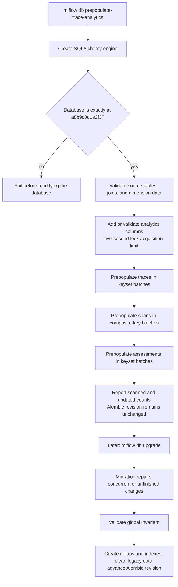
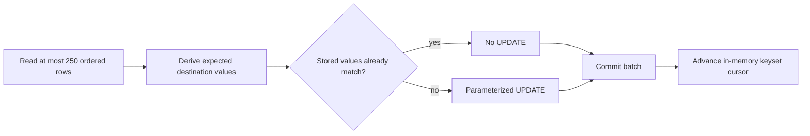

# Prepopulate denormalized trace analytics

## Context

This note covers RHOAIENG-78198 specifically. The complete architecture, seven-story delivery plan, rollup subsystem, and RFC scope are in [2026-07-31 - Implement RFC 0006 PostgreSQL trace analytics optimization](2026-07-31%20-%20Implement%20RFC%200006%20PostgreSQL%20trace%20analytics%20optimization.md). The canonical concept map for the RFC is [PostgreSQL trace analytics optimization](../Maps/PostgreSQL%20trace%20analytics%20optimization.md); implementation-specific concepts remain in this task's `Concepts encountered` section.

MLflow's trace analytics queries currently reconstruct commonly filtered and grouped values from normalized tag and metadata tables. RFC 0006 proposes copying hot analytics fields onto the main trace, span, and assessment rows, adding targeted indexes, and optionally maintaining daily rollups. The RFC reports a representative 20-request serial replay improving from 1,891.9 seconds on `master`, to 119.4 seconds with denormalization, and to 36.8 seconds with rollups. These figures are RFC benchmark evidence, not a prediction for every deployment.

RHOAIENG-78198 asks for a supported utility that fills the new denormalized fields while MLflow is still serving traffic. Its purpose is to move most of the expensive data rewrite out of the synchronous schema-upgrade window. The final Alembic migration must still detect unfinished work, complete it, and validate the result.

### Delivery chain as verified on 2026-08-04

| Item | Role | Verified state |
| --- | --- | --- |
| RHOAIENG-78197 | Parent optimization effort | Active parent of this work |
| RHOAIENG-78202 | Single SQL trace analytics migration | Closed; this ticket's blocker is resolved |
| PR #24588 | Adds the analytics schema migration | Prior migration work on the RFC feature branch |
| PR #24760 | Retargets trace analytics reads and writes | Local implementation base at commit `b5de124f1` |
| RHOAIENG-78198 | Live prepopulation utility | In Progress; implemented and tested in local branch `rhoaieng-78198-prepopulate` |
| RHOAIENG-78204 | Rollout and operations documentation | New; Jira records it as blocked by this ticket |

## Objective

Implement a rerunnable utility that prepopulates the denormalized trace analytics fields in bounded batches against a live MLflow database, without pretending that the database migration has completed. Leave the migration as the final source of truth for catch-up and validation.

### Jira objective-to-implementation matrix

| Jira objective or acceptance criterion | Implementation | Evidence | Current result |
| --- | --- | --- | --- |
| Prepopulate new trace, span, and assessment analytics fields before upgrade | Added `mlflow db prepopulate-trace-analytics`; the library derives and writes all three entity groups | `mlflow/db.py`; `mlflow/store/db/trace_analytics_prepopulation.py` | Implemented and tested |
| Make the utility safe to run against a live deployment | Preflight validation, bounded transactions, mismatch-only updates, five-second DDL lock acquisition limits, no legacy deletion, and no revision advancement | `trace_analytics.py`; `_run_entity_batches`; live-row deletion test | Implemented with explicit operational limits |
| The utility can be rerun safely if interrupted | Every batch commits independently; reruns restart the scan and skip rows already equal to the derived result | idempotency and simulated-interruption tests | Implemented and tested |
| The migration validates and completes partial prepopulation | The migration adds any missing columns, recomputes all entities, updates only mismatches, validates the result, then performs indexes, rollups, and cleanup | modified revision `75868b020152`; partial-prepopulation tests | Implemented and tested |

## Scope

### Included

- Populate the denormalized analytics columns introduced by the RFC migration for traces, spans, and assessments.
- Add missing analytics columns before the Alembic upgrade and validate columns left by a partially completed run.
- Run while normal MLflow writes continue, within documented DDL-lock and workload constraints.
- Bound transaction size, lock duration, memory use, and retry cost.
- Make interruption and rerun safe.
- Provide operational progress and failure information.
- Ensure the final migration can finish a partially prepopulated database and validate completeness.

### Excluded

- Replacing or stamping the Alembic migration.
- Creating the RFC's rollup tables or analytics indexes during prepopulation.
- Deleting legacy metadata, metrics, or `dimension_attributes` during prepopulation.
- Claiming zero production impact; the utility still creates database read/write load.
- Changing analytics query semantics beyond RFC 0006 and its implementation PRs.

## What changed

- Added the supported CLI command `mlflow db prepopulate-trace-analytics` in `mlflow/db.py`.
- Added `mlflow/store/db/trace_analytics.py` as the shared additive schema contract used by the utility and the unreleased RFC migration.
- Added `mlflow/store/db/trace_analytics_prepopulation.py` as the library implementation for preflight validation, batching, derivation, conditional updates, and progress statistics.
- Modified Alembic revision `75868b020152` so it accepts a partially expanded schema and skips already-correct rows while still repairing mismatches.
- Added `tests/db/test_trace_analytics_prepopulation.py` covering idempotency, interruption, partial schemas, final migration catch-up, DDL timeout behavior, progress, schema contracts, supported SQL dialect compilation, and CLI credential handling.

## Implementation architecture

### File responsibilities

| File | Responsibility | Why it is separate |
| --- | --- | --- |
| `mlflow/db.py` | User-facing command, argument validation, progress output, safe error translation, engine lifecycle | CLI concerns stay out of the database algorithm |
| `mlflow/store/db/trace_analytics.py` | Exact additive column definitions, existing-column compatibility checks, and dialect-specific DDL lock timeout | The utility and unreleased migration must agree on one schema contract |
| `mlflow/store/db/trace_analytics_prepopulation.py` | Source validation, field derivation, keyset batches, mismatch-only updates, and statistics | This is the rerunnable online preparation algorithm |
| `75868b020152_add_sql_trace_analytics_schema.py` | Final catch-up, validation, rollup/index creation, legacy cleanup, and Alembic revision advancement | The migration remains the controlled authoritative transition |
| `tests/db/test_trace_analytics_prepopulation.py` | Contract and integration tests spanning the utility and final migration | The ticket's correctness depends on their interaction, not either component alone |

`db.py` is therefore not a second schema implementation. It is only the command boundary. `trace_analytics.py` defines what the columns must look like, while `trace_analytics_prepopulation.py` determines what values belong in those columns.

### End-to-end execution



## Objective 1 — supported pre-upgrade utility

### Command contract

The implemented interface is:

```bash
MLFLOW_TRACKING_URI='postgresql://user@database/mlflow' \
  mlflow db prepopulate-trace-analytics --batch-size 250
```

The database URL can still be supplied positionally, but `MLFLOW_TRACKING_URI` is the preferred production form because it avoids placing credentials in process arguments and shell history. `--batch-size` accepts `1..250`; `250` is the default. The cap limits transaction size and keeps the composite span query below supported-database parameter limits.

The CLI creates the engine, invokes the library, reports progress and final counts for each entity, translates known failures into Click errors, and always disposes the engine. SQLAlchemy driver errors are deliberately summarized by exception type because driver messages can include the complete DSN.

### Fields populated

| Entity and destination table | Destination columns | Source and derivation |
| --- | --- | --- |
| Trace — `trace_info` | `trace_name`, `session_id` | Reserved trace-name tag and trace-session metadata |
| Trace — `trace_info` | `input_tokens`, `output_tokens`, `total_tokens`, `cache_read_input_tokens`, `cache_creation_input_tokens` | Reserved token metadata, overridden by an explicitly present reserved trace metric even when that metric normalizes to `NULL` |
| Trace — `trace_info` | `input_cost`, `output_cost`, `total_cost` | Reserved trace cost metadata converted to finite floats |
| Span — `spans` | `input_cost`, `output_cost`, `total_cost` | Reserved rows from `span_metrics` for the exact `(trace_id, span_id)` pair |
| Span — `spans` | `model_name`, `model_provider` | Recognized values from `dimension_attributes`, bounded to the model-dimension length |
| Span — `spans` | `dimension_attributes_state` | Encodes SQL `NULL`, JSON `null`, empty object, and the presence of model/provider keys so downgrade and compatibility behavior do not lose those distinctions |
| Assessment — `assessments` | `experiment_id`, `trace_timestamp_ms` | Copied from the assessment's owning `trace_info` row |
| Assessment — `assessments` | `aggregate_value`, `is_numeric_value` | Type-sensitive aggregation of the assessment JSON value; non-numeric values remain distinguishable from numeric values |

The utility uses the same live application conversion helpers for token bounds, finite floats, trace metadata, model dimensions, and assessment values. This keeps prepopulation aligned with the code that writes new data while the old server is running.

### Schema expansion before the data scan

The database is still on revision `a8b9c0d1e2f3`, so the destination columns may not exist yet. `ensure_analytics_columns` handles three states:

1. **Column absent:** add it using Alembic operations.
2. **Column already correct:** leave it unchanged. This is how a run continues after partial DDL.
3. **Column present but incompatible:** fail with the table, column, and mismatch rather than writing into a schema with the wrong type, nullability, or server default.

The helper reinspects after every column addition because MySQL and some other engines can implicitly commit DDL. If the process stops after adding only some columns, the next run discovers the exact resulting schema instead of assuming the earlier DDL was atomic.

## Objective 2 — safe against a live deployment

“Safe” here means the operation is bounded, non-destructive, retryable, and subordinate to the final migration. It does not mean free of database load.

### Preflight before modification

Before adding a column or updating a row, the utility verifies:

- the database is exactly at the predecessor revision `a8b9c0d1e2f3`;
- every required source table and source column exists;
- every span and assessment refers to an existing trace;
- existing `dimension_attributes` contain only the model/provider shapes the migration knows how to preserve.

This is [Fail-fast validation](../Concepts/Fail-fast%20validation.md): an unsupported database state is rejected before beginning the long update phase. In particular, dimension data is validated before schema expansion so malformed or unsupported legacy content does not leave an avoidable partial expansion.

### DDL locking is bounded

Adding a column requires a brief strong table or metadata lock even when the database can perform the alteration without rewriting every row. An unbounded `ALTER TABLE` can wait behind a long transaction and queue later traffic behind itself.

The utility limits lock acquisition to five seconds:

| Backend | Session/transaction setting |
| --- | --- |
| PostgreSQL | `SET LOCAL lock_timeout = '5000ms'` |
| MySQL | Temporarily sets `SESSION lock_wait_timeout = 5`, then restores the previous value |
| SQL Server | Temporarily sets `LOCK_TIMEOUT 5000`, then restores the previous value |
| SQLite | Relies on the connection's existing busy timeout for its database-wide write lock |

If the DDL cannot acquire its lock, the command reports that the operator should verify `ALTER` permission and retry during a low-traffic period after long-running transactions finish. The final offline migration does not inherit this five-second setting; its controlled upgrade behavior remains unchanged.

### Data work is bounded by transaction

Each batch runs inside its own `engine.begin()` block:



This [Transaction boundary](../Concepts/Transaction%20boundary.md) limits lock lifetime, WAL/redo growth, rollback cost, replication bursts, and how much work an interruption can lose. The algorithm does not issue an update for an already-correct row, which reduces write amplification and index maintenance.

A row can be deleted by the live application after the batch read but before the update. `_execute_updates` accepts a short multi-row update count for this reason instead of treating it as migration corruption. The final migration will evaluate the database that actually remains.

### Explicit non-destructive boundary

The utility does not:

- update the Alembic version table;
- delete trace metadata, trace metrics, span metrics, or dimension attributes;
- create rollup tables or analytics indexes;
- claim that reaching the end of its cursors proves global completeness.

Those operations remain in the final migration after its catch-up and validation steps.

## Objective 3 — safe interruption and rerun

The utility is restartable because each completed batch commits independently and the transformation has [Idempotency](../Concepts/Idempotency.md). It is important to distinguish restartability from a persisted checkpoint:

- the cursor exists only in process memory;
- after interruption, a rerun starts each entity scan from the beginning;
- rows whose stored values already equal the freshly derived values are scanned but not rewritten;
- rows that are missing, stale, or partially populated are repaired;
- if a legacy source value disappeared, the now-stale destination value is cleared back to the correct `NULL` state.

```mermaid
sequenceDiagram
    participant U1 as First utility process
    participant DB as Database
    participant U2 as Rerun

    U1->>DB: Batch 1: derive, update, commit
    U1->>DB: Batch 2: derive, update, commit
    U1->>DB: Begin batch 3
    Note over U1: Process interrupted
    DB-->>DB: Batches 1 and 2 remain committed
    U2->>DB: Restart scan from first key
    DB-->>U2: Earlier rows match; no UPDATE
    U2->>DB: Repair incomplete batch 3 and continue
```

This costs an `O(n)` reread after a late interruption, but avoids storing and coordinating a durable checkpoint. The 250-row cap bounds repeated work within the interrupted transaction, and mismatch-only updates keep the reread substantially cheaper than rewriting the table again.

For operability, `_run_entity_batches` exposes a callback with cumulative `scanned` and `updated` counts. The CLI emits progress after the first batch and every 100 batches, followed by final totals for traces, spans, and assessments. The callback keeps presentation out of the library implementation.

## Objective 4 — migration remains the final source of truth

The utility refuses to run after revision `75868b020152` has been applied and never stamps that revision itself. Its completion message explicitly instructs the operator to run `mlflow db upgrade` later.

The final migration remains authoritative because it performs the full transition:

1. validate trace ownership and supported dimension data;
2. add or validate any analytics columns missing from partial prepopulation;
3. recompute trace, span, and assessment values across the full database;
4. update only rows whose current destination values differ;
5. validate the completed backfill invariant;
6. create rollup tables and analytics indexes;
7. remove legacy duplicate analytics rows and `dimension_attributes`;
8. let Alembic record revision `75868b020152` as applied.

### Concurrent-write handoff

| Event while the utility runs | Utility result | Final migration behavior |
| --- | --- | --- |
| Source row inserted ahead of the cursor | Normally seen in a later batch | Rechecks and validates it |
| Source row inserted behind the cursor | May be missed | Full migration scan derives it |
| Source row changes after its batch | Destination may become stale | Mismatch comparison repairs it |
| Source row changes during read/derive/update | Utility can observe either ordering | Controlled final pass establishes the final value |
| Row is deleted between read and update | Short update count is tolerated | Deleted row is no longer part of the invariant |
| Utility stops after only some columns or entities | Existing work remains usable | Missing columns and residual values are completed |

Correctness therefore comes from a defined [Authoritative data representation](../Concepts/Authoritative%20data%20representation.md) and final [Data migration validation](../Concepts/Data%20migration%20validation.md), not from treating the utility's last cursor as proof.

### Shared schema, frozen migration semantics

The unreleased RFC migration and utility share `ensure_analytics_columns`, so their column names, types, nullability, and server defaults cannot drift during this feature's development. The migration's value-conversion helpers remain local and frozen because importing mutable application conversion code would allow a future application change to alter historical migration behavior.

An explicit fixed-corpus parity test compares the migration and current shared helpers for:

- finite floats, non-finite values, and booleans;
- integral token counts and signed `BIGINT` boundaries;
- assessment values;
- model/provider dimension representations and truncation.

This makes drift fail in tests while preserving migration reproducibility.

## Decisions and tradeoffs

### Keep the migration authoritative

- **Decision:** The utility should perform additive data preparation only; it must not advance Alembic state.
- **Reason:** Prepopulation can be interrupted and races with live writes. The migration is the controlled point that must catch up and prove the invariant before the upgraded schema is considered ready.
- **Alternative:** Stamping the migration after prepopulation would shorten upgrade work further, but could certify an incomplete or stale database.

### Share the schema contract but freeze migration value logic

- **Decision:** Share additive column definitions between the unreleased migration and utility, reuse live writer conversion helpers in the utility, and keep the migration's conversion implementation frozen behind parity tests.
- **Reason:** Schema drift during feature development is prevented without making a historical migration change whenever live application code changes.
- **Alternative:** Import every live helper into the migration. This removes present-day duplication but weakens reproducibility after release.

### Commit bounded key ranges

- **Decision:** Use [Keyset pagination](../Concepts/Keyset%20pagination.md) over stable entity keys and commit each bounded batch in its own [transaction](../Concepts/Transaction%20boundary.md).
- **Reason:** This bounds locks, WAL growth, rollback work, and memory while preserving already committed work.
- **Alternative:** One transaction gives a simple all-or-nothing view, but makes a large live backfill operationally risky. Offset pagination becomes progressively more expensive and is unstable while rows change.

### Make already-correct rows cheap to revisit

- **Decision:** Updates should be conditional on missing or incorrect derived values and should converge on the same result when repeated.
- **Reason:** [Idempotency](../Concepts/Idempotency.md) is necessary for safe retries and for the migration to revisit work after the utility stops.
- **Alternative:** Blindly rewriting every row is simpler but causes unnecessary locks, write amplification, index maintenance, and replication traffic.

### Treat concurrent writes as expected

- **Decision:** The final migration must scan for residual work rather than trusting the utility's last cursor or row count.
- **Reason:** New and modified traces may appear behind or ahead of the utility's scan while MLflow remains live.
- **Alternative:** Freezing writes would simplify completeness, but contradicts the ticket's live-deployment goal.

### Bound DDL lock acquisition instead of hiding it

- **Decision:** Apply a five-second lock acquisition timeout in the prepopulation utility and give explicit retry guidance.
- **Reason:** An `ALTER TABLE` waiting indefinitely behind a live transaction can queue subsequent traffic and turn a preparation job into an availability incident.
- **Alternative:** Assume metadata-only column addition is harmless. That ignores the strong lock still required to install the metadata change.

### Prefer environment-based database URL input

- **Decision:** Support `MLFLOW_TRACKING_URI` and avoid echoing raw SQLAlchemy errors.
- **Reason:** Positional URLs and driver errors can expose database passwords through shell history, process listings, or terminal output.
- **Alternative:** Follow the older `mlflow db upgrade <url>` convention unchanged; this is convenient but weaker for a production-oriented command.

## Review feedback

| Review finding | Response |
| --- | --- |
| DDL had no lock timeout and could stall a live deployment | Added PostgreSQL, MySQL, and SQL Server timeout handling plus actionable failure text and CLI documentation |
| Migration and utility value logic could drift | Preserved frozen migration semantics and added fixed-corpus parity tests instead of importing mutable live helpers into the migration |
| Long runs had no incremental progress | Added a UI-independent progress callback and CLI output |
| Cross-dialect behavior was not demonstrated locally | Added query-compilation and lock-setting tests for SQLite, PostgreSQL, MySQL, and SQL Server; confirmed the repository database CI job runs all of `tests/db` against its database services |
| Server-default parity was not asserted | Added ORM/schema contract checks and rejection of an incompatible `is_numeric_value` default |
| Migration imports a live schema helper | Documented that this is intentional only for the unreleased mutable RFC migration; value behavior remains frozen |
| URL and driver errors could leak credentials | Added `MLFLOW_TRACKING_URI` input and credential-safe SQLAlchemy error output with a regression test |
| “Resume” wording hid a full rescan | CLI and library documentation now state that reruns scan from the beginning and skip correct rows |
| Batch size of 250 lacked rationale | CLI help now connects the cap to transaction lock duration and cross-database parameter limits; library and CLI both reject values outside `1..250` |

## Verification

- `python -m pytest tests/db/test_trace_analytics_prepopulation.py tests/db/test_trace_analytics_migration.py` — **73 passed** after formatting. This covers the utility, existing migration behavior, partial prepopulation, idempotency, interruption, and final repair.
- `python -m pytest tests/db/test_schema.py tests/store/tracking/test_trace_analytics.py tests/store/tracking/sqlalchemy_store/test_sqlalchemy_store_schema.py tests/db/test_trace_analytics_prepopulation.py tests/db/test_trace_analytics_migration.py` — **118 passed**, with one pre-existing Pytest deprecation warning in `test_schema.py`.
- `pre-commit run --files ...` over the five changed files — all applicable hooks passed, including Ruff, format, unresolved-import, Clint, typo checks, and project validation hooks.
- `git diff --check` — clean.
- Dialect unit coverage verifies emitted lock-timeout statements and compiles the span composite-key lookup for SQLite, PostgreSQL, MySQL, and SQL Server.
- The repository's database GitHub Actions job runs `tests/db` against its configured PostgreSQL, MySQL, SQL Server, and SQLite services. Those external services were not started locally in this session, so their execution result remains CI evidence to collect after pushing.

## Outcome

RHOAIENG-78198 is implemented and locally validated in the dedicated worktree:

```text
/Users/ncarcasc/RH_DEV_MAIN/worktrees/rhoaieng-78198-trace-analytics-prepopulation
branch: rhoaieng-78198-prepopulate
base: b5de124f1
```

The working tree contains two modified files and three new files. The implementation is not yet committed, pushed, or represented by its own pull request, so the Jira story correctly remains In Progress.

## Concepts encountered

- [Entity-attribute-value model](../Concepts/Entity-attribute-value%20model.md) — explains why reconstructing hot fields from generic metadata tables makes analytics queries expensive.
- [Database denormalization](../Concepts/Database%20denormalization.md) — is the RFC's primary read-performance strategy.
- [Database index](../Concepts/Database%20index.md) — makes the copied fields useful for selective filtering and grouping.
- [Database rollup table](../Concepts/Database%20rollup%20table.md) — explains the RFC's optional second optimization for repeated aggregate queries.
- [Online schema migration](../Concepts/Online%20schema%20migration.md) — frames how old and new software and data representations coexist during rollout.
- [Database backfill](../Concepts/Database%20backfill.md) — is the core operation the utility moves ahead of the upgrade window.
- [Keyset pagination](../Concepts/Keyset%20pagination.md) — provides stable, bounded traversal of a changing table.
- [Transaction boundary](../Concepts/Transaction%20boundary.md) — controls lock duration, recovery granularity, and visibility of each batch.
- [Data migration validation](../Concepts/Data%20migration%20validation.md) — distinguishes “the utility finished” from “the database invariant is proven.”
- [Idempotency](../Concepts/Idempotency.md) — makes retry, catch-up, and partial-state repair safe.
- [Backward compatibility](../Concepts/Backward%20compatibility.md) — matters while rollout code reads or writes data created by different versions.
- [Authoritative data representation](../Concepts/Authoritative%20data%20representation.md) — explains why the final migration, not the utility cursor, resolves disagreement and certifies the new stored form.
- [Fail-fast validation](../Concepts/Fail-fast%20validation.md) — applies to revision, source-schema, legacy-data, and DDL-lock checks before or early in the run.
- [Environment variable](../Concepts/Environment%20variable.md) — provides the safer `MLFLOW_TRACKING_URI` route for production database configuration.
- [Race condition](../Concepts/Race%20condition.md) — concurrent inserts, updates, and deletes explain why prepopulation alone cannot prove completeness.

## Follow-up

- Review the final diff after the latest safety changes, then commit the five-file implementation.
- Push the branch and open a PR against `mlflow/mlflow:rfc-0006`, including the RFC link and `mlflow/mlflow#24546` reference.
- Require the database CI job, especially PostgreSQL, before merge; capture any dialect-specific failures here.
- Add the resulting PR URL and commit to this note and the Jira development field.
- Update RHOAIENG-78204 with the concrete invocation, backup requirement, quiet-window guidance, progress behavior, rerun cost, and mandatory final `mlflow db upgrade` step.
